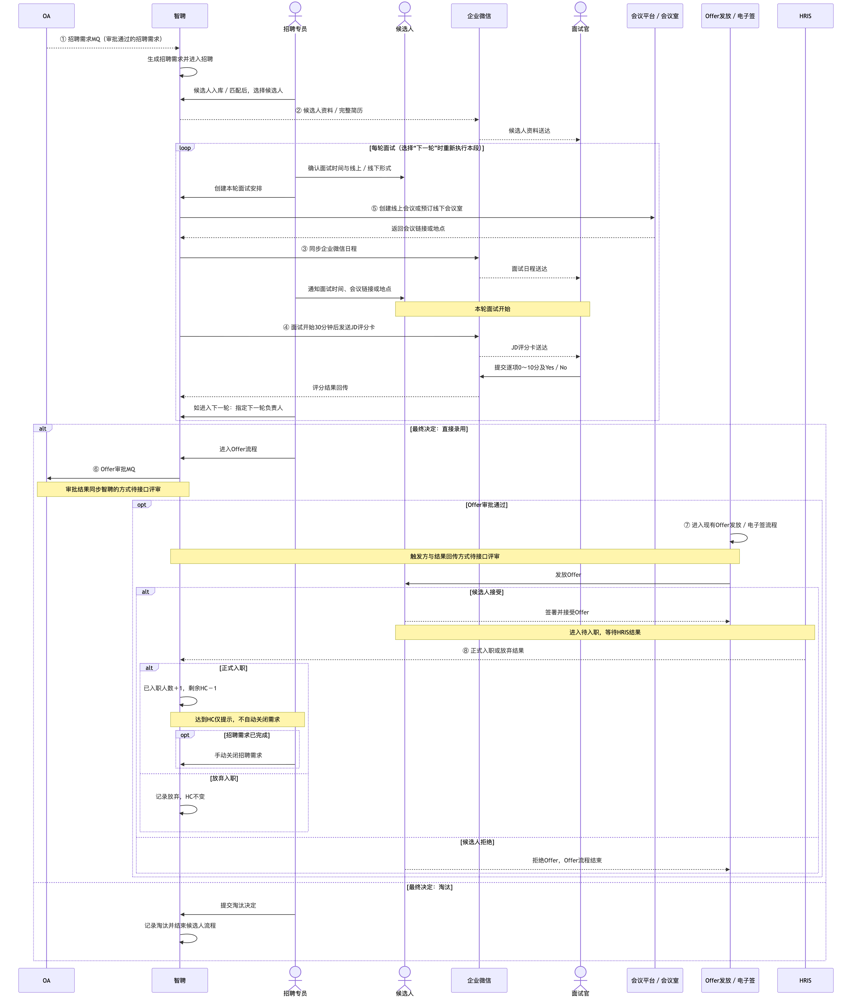

# 智聘目标态招聘业务泳道图（研发视图）

> 状态：2026-07-15 需求对齐稿  
> 受众：智聘研发、OA / 企业微信 / 会议 / Offer / HRIS 对接人员  
> 重要口径：图中的 ①～⑧ 全部是**待研发的对接能力**，不代表外部接口已经存在或已经接通。

## 一、业务泳道图



- 可编辑 Mermaid 源文件：[09_招聘中控台线性流程图.mmd](./diagrams/09_招聘中控台线性流程图.mmd)
- 每条纵向泳道代表一个角色或系统，箭头表示业务动作和数据方向，①～⑧标在需要研发对接的位置。
- 主线为“需求进入 → 候选人 → 面试 → 人工决策 → Offer → 入职 / HC”；选择“下一轮”时重复面试段。

## 二、8 项待研发对接能力

此处只确认业务边界。Topic、URL、字段、鉴权、幂等和错误处理在后续接口评审中确定，不放入主流程图。

| 编号 | 项目 capability | 方向 | 已确认的业务内容 |
|---|---|---|---|
| ① | `recruitment_demand_oa` | `OA → 智聘` | OA 审批通过的招聘需求进入智聘 |
| ② | `wecom_material_delivery` | `智聘 → 企业微信 → 面试官` | 推送候选人资料和完整简历 |
| ③ | `wecom_calendar` | `智聘 → 企业微信` | 同步面试官日程 |
| ④ | `wecom_scorecard_delivery` | `智聘 ↔ 企业微信` | 面试开始 30 分钟后发送 JD 评分卡并回传结果 |
| ⑤ | `meeting_arrangement` | `智聘 ↔ 会议平台 / 会议室` | 创建线上会议或预订线下会议室，返回链接或地点 |
| ⑥ | `offer_oa` | `智聘 → OA`；审批结果同步方式待确认 | 发起 Offer 审批；审批通过后才进入发放流程 |
| ⑦ | `offer_delivery` | 触发方与结果回传方向待接口评审 | 使用现有系统完成 Offer 发放、电子签，并将结果同步智聘 |
| ⑧ | `hris_onboarding` | `HRIS → 智聘` | 同步正式入职或放弃结果；正式入职后扣减 HC |

## 三、研发必须按此理解的业务规则

1. 招聘需求的主方向是 `OA → 智聘`，Offer 审批的主方向是 `智聘 → OA`。
2. JD 评分卡在**面试开始后 30 分钟**发送；面试官逐项打 `0～10` 分并提交 `Yes / No`，不设置“待定”。
3. 招聘专员人工决定“下一轮、直接录用或淘汰”；选择下一轮时指定下一轮负责人，再重新确认时间并安排面试。
4. 候选人的通知渠道尚未最终确定，主图仅保留“招聘专员通知候选人”这一业务动作。
5. Offer 阶段不扣减 HC；只有 HRIS 确认正式入职后才扣减 HC。
6. 达到 HC 只提示，不自动关闭招聘需求；确认招聘完成后由招聘专员手动关闭。

## 四、尚待接口评审确认

- 候选人通知最终采用电话、邮件、短信还是其他渠道。
- 线上会议平台和线下会议室系统的正式名称及能力边界。
- Offer 系统、OA 与智聘之间最终由谁回传哪些状态。
- HRIS 的候选人匹配方式、入职结果状态和回传协议。

## 五、资料依据与冲突处理

本图采用以下优先级：会议逐字稿确定目标流程，飞书文档补充业务规则，用户提供的《接口清单.md》和当前项目用于验证系统边界与 capability 名称。资料不一致时保留为待确认事项，不在图中自行补全。

- [会议妙记：智聘系统招聘流程讨论](https://my.feishu.cn/minutes/obcnttwg1e13mna598g2445v?from=from_copylink)
- [飞书文档](https://my.feishu.cn/docx/OYshdQxEVo1YUixQ5E0ccWqQnEd)
- 用户提供的《接口清单.md》（作为输入资料读取，不复制进项目仓库）
- [项目总览](../README.md)
- [PRD：招聘中控台边界](./01_PRD.md)
- [SDD：外部接口准备状态](./SDD-智聘招聘系统-v1.0.md)
- [8 项 capability 代码目录](../backend/app/integrations/capabilities.py)

已按会议逐字稿校正歧义：评分卡触发点采用“面试开始后 30 分钟”；招聘需求与 Offer 审批采用相反的主方向。

## 六、重新导出 PNG

仓库不新增 Mermaid 依赖。可使用 Mermaid CLI 11.12.0 从 `.mmd` 重新生成 PNG：

```bash
npx --yes @mermaid-js/mermaid-cli@11.12.0 \
  -i docs/diagrams/09_招聘中控台线性流程图.mmd \
  -o docs/diagrams/09_招聘中控台线性流程图.png \
  -b white -w 3200 -s 2
```
