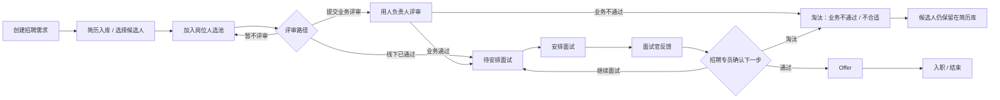

# 智聘产品交互逻辑文档

> 更新时间：2026-07-23
> 适用范围：智聘招聘系统上线前产品交互、页面跳转、按钮行为、真实数据流转与 AI/研发实现对齐。
> 阅读对象：AI/Codex、产品经理、交互设计师、前端研发、后端研发、测试同学。

## 1. 文档目的

本文不是演示说明书，而是上线产品交互逻辑真源。AI 和研发需要通过本文理解：

- 用户进入每个页面后要完成什么招聘任务。
- 页面上每个主要按钮、数字、状态、筛选项点击后去哪里。
- 哪些动作只读查看，哪些动作必须真实写入数据库。
- 哪些页面使用弹窗、抽屉，哪些页面跳转到新路由。
- 列表、统计、待办和状态如何从真实产品数据生成。
- 空数据、接口失败、权限不足、误操作时用户下一步怎么办。

本文中的所有页面都按真实上线目标描述。页面不允许依赖前端写死的演示数字来支撑业务判断；如研发需要临时种子数据用于本地模拟，也必须通过后端数据库或种子脚本生成，并走同一套真实接口。

几个简单词先统一：

- **真实接口**：前端调用后端 API，后端读写数据库或真实业务适配层；刷新页面、换账号、接正式数据库后状态仍然一致。
- **演示数据**：前端写死或临时拼出来的数据，只为页面好看，不能支撑上线。本产品交互文档不把演示数据作为正式逻辑。
- **跳转带上下文**：用户点击数字、待办或列表项时，URL 必须带筛选条件，例如 `?status=active`、`?demand=123`、`?stage=interview`。
- **弹窗**：盖在当前页面上的操作窗口，适合新建、确认、轻量表单。
- **抽屉**：从右侧滑出的详情/处理面板，适合在不丢失当前筛选条件的情况下处理较长内容。

## 2. 产品总流程

智聘是一套给公司内网招聘专员和招聘管理者使用的招聘 SOP 平台。核心目标是让招聘需求、候选人、面试、Offer、入职和复盘数据真实流转，并能量化每一步责任和进度。

主流程：

业务口径：

- 招聘需求是主线。一条招聘需求代表一次真实招聘责任单。
- 岗位/JD 是招聘需求使用的岗位画像，不替代招聘需求本身。
- 简历先进入简历库，再被加入具体招聘需求。
- 候选人由招聘专员先加入岗位流程，再决定提交业务评审、补录线下通过或暂留岗位人选池；不是企业微信同意后才加入岗位。
- 用人负责人就是该需求的默认面试官，也是业务评审任务的接收人；正式面试时仍允许招聘专员按轮次更换面试官。
- 企业微信只是评审通知和回传渠道，招聘阶段、评审任务和结果仍以智聘数据库为准。
- 同一候选人同一时间只允许处于一个进行中的招聘需求；要去另一个需求必须使用“转入其他需求”，不能重复加入。
- 业务不通过后进入淘汰状态，标准原因为“业务不通过 / 不合适”，该候选人主档和简历继续保留在简历库，可用于其他岗位。
- 面试安排、调整、取消、反馈必须落库，并能被工作台和面试管理继续读取。
- Offer 状态必须真实保存，不能只在页面上切换文案。
- 工作台是所有登录用户进入系统后的默认首页，负责展示真实待办、真实进度和真实风险。
- AI 助手可以查询、总结、建议；涉及推进、淘汰、转派、Offer、关闭需求等关键动作时，必须走人工确认和后端权限校验。

## 3. 角色与入口

| 角色 | 默认首页 | 可见入口 | 核心任务 |
|---|---|---|---|
| 招聘专员 | 工作台 | 工作台、招聘管理、简历库、人才地图、面试管理、AI 助手 | 建需求、导简历、筛候选人、安排面试、推进流程、跟进 Offer |
| 招聘经理/负责人 | 工作台 | 工作台、招聘管理、简历库、人才地图、面试管理、Offer 管理、AI 助手 | 看团队进度、处理卡点、转派负责人、查看 Offer 与入职 |
| 面试官 | 工作台 | 工作台、我的面试、候选人详情 | 查看分配给自己的面试，提交反馈 |
| 管理员 | 工作台 | 以上入口 + 系统设置、AI 调用日志 | 管账号、看审计、查 AI 调用、维护系统配置 |

权限边界：

- 前端菜单隐藏不是安全边界，后端权限校验才是安全边界。
- 招聘专员主要处理自己负责或被授权的招聘需求和候选人。
- 面试官不能浏览全量简历库，不能推进流程、淘汰候选人或发 Offer。
- 管理员不能停用或降级自己。

## 4. 全局交互规则

1. 所有统计数字、列表数量、待办数量都必须来自后端真实接口。
2. 所有可点击数字必须带筛选条件跳转到对应页面。
3. 表格状态栏、表头下拉、更多筛选按钮都必须真实影响列表结果，不能只展示菜单。
4. 候选人姓名必须可点击查看候选人详情。
5. 招聘需求/岗位名称必须可点击查看需求或岗位详情。
6. 用户在列表页筛选出的上下文应尽量保留；处理详情优先使用弹窗或右侧抽屉。
7. 弹窗和抽屉内容过长时，内部必须可以顺滑滚动到底部。
8. 写操作必须有 loading、防重复提交、成功提示、失败原因和重试方式。
9. 接口失败不能伪装成 0 或空列表，必须显示真实错误状态。
10. 空列表不能只写“暂无数据”，必须告诉用户下一步去哪里创建、导入、调整筛选或联系管理员。

## 5. 工作台

路由：`/`

### 用户目标

招聘专员进入系统后第一眼看到今天要处理什么、哪些招聘需求有风险、哪些候选人需要推进、哪些面试反馈和 Offer 需要跟进。

### 入口

- 登录成功后默认进入工作台。
- 左侧菜单点击“工作台”进入。
- 其他页面处理完任务后，可返回工作台查看整体状态是否变化。

### 页面上有什么

工作台至少包含：

- 顶部统计卡：在招需求、当前流程人数、待补面试反馈、本周新增简历。
- 今日待办：今日面试、待安排面试、待补反馈、待推进候选人、待处理 Offer。
- 我的招聘需求进展：每条需求的 HC、待筛选、业务反馈、面试中、Offer、已入职、剩余 HC。
- 阶段分布：当前候选人在各招聘阶段的人数。
- 来源分布：候选人来源渠道人数。
- 风险提醒：长时间未推进、面试反馈逾期、Offer 待回复、需求接近截止日期。

### 用户可以点什么

- 点击“在招需求”统计卡。
- 点击“当前流程人数”统计卡。
- 点击“待补面试反馈”统计卡。
- 点击“本周新增简历”统计卡。
- 点击任一待办行。
- 点击某条招聘需求名称。
- 点击某条招聘需求里的阶段数字。
- 点击来源分布中的来源项。
- 点击风险提醒。
- 点击快捷按钮：新增招聘需求、导入简历、去简历库、安排面试。

### 点了以后发生什么

所有点击都必须带上下文跳转：

| 点击对象 | 跳转目标 |
|---|---|
| 在招需求 | `/demands?status=active` |
| 当前流程人数 | `/pipeline?scope=active_demands&stage=all` |
| 待补面试反馈 | `/interviews?focus=pending_feedback` |
| 本周新增简历 | `/candidates?created=this_week` |
| 今日面试 | `/interviews?date=today` |
| 待安排面试 | `/pipeline?schedule=unassigned` |
| 待推进候选人 | `/pipeline?focus=stale` |
| 待处理 Offer | `/offers?status=pending_action` |
| 招聘需求名称 | `/demands/<demand_id>` |
| 需求阶段数字 | `/pipeline?demand=<demand_id>&stage=<stage>` |
| 来源分布项 | `/candidates?source=<source>` |
| 风险提醒 | 对应风险详情页或带筛选的列表页 |

如果当前系统暂时仍使用 `/bi` 承载 Offer 管理，所有 Offer 入口也必须带 `status` 参数跳转，例如 `/bi?status=accepted`。目标产品建议统一为 `/offers`。

### 是否弹窗/抽屉/跳转

- 工作台统计和待办点击以跳转为主。
- 快捷“新增招聘需求”可以打开创建需求弹窗，也可以跳转到招聘管理并自动打开创建弹窗。
- 风险提醒如果只需要查看摘要，可先打开抽屉；如果需要处理，应进入对应业务页面并带筛选条件。

### 数据从哪里来

工作台必须由后端真实汇总接口提供。建议接口：

`GET /api/workbench/summary`

建议返回：

- `summary_cards`：顶部统计卡。
- `todos`：当前用户待办。
- `demand_progress`：当前用户可见招聘需求进展。
- `stage_distribution`：阶段分布。
- `source_distribution`：来源分布。
- `risk_alerts`：风险提醒。

该接口的数据应来自招聘需求、候选人流程、面试安排、面试反馈、Offer、上传批次等真实表。前端不能自行拼出业务真相。

### 空状态怎么处理

- 没有招聘需求：提示“还没有招聘需求”，提供“新增招聘需求”入口。
- 没有待办：提示“当前没有待处理事项”，但仍展示招聘需求进展和统计。
- 没有简历：提示“还没有候选人简历”，提供“导入简历”入口。

### 异常状态怎么处理

- 工作台接口失败：显示“工作台数据暂不可用”，提供重试按钮。
- 部分模块失败：失败模块单独显示错误，其他模块正常展示。
- 权限不足：不展示无权限数据，并提示联系管理员确认账号角色。

### 仍需确认的问题

- 是否新增正式路由 `/offers` 承载 Offer 管理；如短期继续使用 `/bi`，文档和页面必须统一说明。

## 6. 招聘管理

路由：`/demands`

招聘管理是本产品的业务主脉络，不只是“招聘需求列表”。它串联需求建立、选择候选人、业务评审、面试交接、流程推进和需求关闭。

### 用户目标

招聘专员以一条招聘需求为单位完成招聘 SOP：知道岗位要招谁、谁负责、当前有多少候选人、每个人卡在哪一步、下一步该点什么，并且每次操作都能留下真实数据和责任记录。

### 入口

- 左侧菜单“招聘管理”。
- 工作台“在招需求”“招聘需求名称”“新增招聘需求”等入口。
- 候选人、面试、Offer 页面回链到对应招聘需求。
- 所有入口必须携带 `demand_id` 和当前筛选条件；返回时恢复原列表页、页码和筛选。

### 页面上有什么

- 状态栏：全部、需求待确认、招聘中、已完成、已关闭。
- 搜索框：需求编号、岗位名称、部门、城市、招聘负责人、用人负责人。
- 筛选项：部门、城市、招聘负责人、需求状态、优先级、截止日期、候选人阶段。
- 排序：最新发布、优先级、截止日期临近。
- 表格列：需求/岗位、部门与城市、招聘负责人、用人负责人、HC/截止日期、阶段进度、需求状态、主操作。
- 主操作：招聘中的需求显示“选候选人”；暂停、完成或关闭的需求显示“查看候选人”。
- 右上角“新增招聘需求”。
- 列表不再保留没有菜单内容的三点按钮。调整优先级、转派、暂停、关闭、恢复统一进入需求详情处理，避免同一动作出现两套入口。

### 用户可以点什么

- 状态栏、搜索框、排序和每个筛选项。
- 需求/岗位名称。
- 业务待反馈、待安排面试、面试中、Offer、已入职等阶段数字。
- “新增招聘需求”“选候选人”“查看候选人”。
- 需求详情中的调整优先级、转派招聘负责人、暂停、关闭、恢复。
- 选择候选人弹窗中的候选人姓名、筛选项和三个流程动作。

### 点了以后发生什么

| 点击对象 | 真实结果 |
|---|---|
| 状态栏、搜索、筛选、排序 | 后端按条件重新查询；URL 同步条件，刷新和返回后仍保留 |
| 需求/岗位名称 | 打开需求详情；列表场景优先右侧抽屉，完整页面路由为 `/demands/<demand_id>` |
| 阶段数字 | 跳转 `/pipeline?demand=<demand_id>&stage=<stage>` |
| 新增招聘需求 | 打开可滚动弹窗；保存成功后生成需求和岗位画像并进入需求详情 |
| 选候选人 | 在当前页打开“选择候选人”弹窗，不清空招聘管理筛选 |
| 查看候选人 | 跳转 `/pipeline?demand=<demand_id>&stage=all` |
| 暂停/关闭/恢复/转派 | 打开确认弹窗；填写原因后真实写库并刷新需求状态 |

#### “选择候选人”弹窗

弹窗顶部固定显示本次目标岗位、部门、城市和需求编号，主体区域独立滚动，底部操作区固定。弹窗不能再出现只有灰色遮罩而没有内容的状态。

候选人列表显示：

- 候选人姓名，点击后打开真实候选人详情，不关闭当前筛选上下文。
- 最近任职岗位、意向城市、学历、来源、岗位匹配度。
- 当前/最近招聘需求、当前阶段、最近更新时间。
- 加入状态：可加入、已在当前岗位、其他岗位流程中、流程已结束。
- “其他岗位流程中”不可直接勾选加入，应提供“转入当前岗位”入口并要求填写转移原因。
- “已在当前岗位”不可重复加入，点击姓名或状态进入该候选人的当前流程。
- 匹配度必须来自岗位匹配接口；接口未返回时显示“未计算”，不能按候选人编号拼出分数。

弹窗筛选：

- 姓名/职位/技能关键词、意向城市、来源、岗位经历、工作年限、学历、加入状态、最近更新时间。
- 排序：岗位匹配度、最近更新、最近入库。
- 每个筛选都必须由后端针对全量可见候选人计算，并返回总数；不能只在当前已加载的 50 条数据上筛选。
- 筛选项的可选值来自数据库或公司字典，不得写死城市、岗位或员工姓名。

#### 三个候选人动作

| 按钮 | 使用场景 | 点击后的真实数据变化 | 后续页面 |
|---|---|---|---|
| 提交业务评审 | 需要用人负责人在线确认 | 候选人加入当前需求；阶段写为 `business_review`；为用人负责人创建评审任务；记录提交人和时间；企微已接通时发送评审卡片 | 当前弹窗显示成功/失败明细；可进入“业务待反馈”列表 |
| 线下已通过，去安排面试 | 用人负责人已在线下、电话或会议中确认通过 | 候选人加入当前需求；补录“线下业务通过”；阶段直接写为 `interview` 的“待安排面试”子状态；记录操作人、时间、确认方式和备注 | 保留当前页，并出现“去安排面试”按钮，进入 `/pipeline?demand=<id>&stage=interview&schedule=unassigned` |
| 仅加入岗位人选池 | 先收进该岗位，暂不发起评审 | 候选人加入当前需求；阶段写为 `pending`；不创建评审任务、不发送通知 | 留在弹窗，可继续选人或关闭 |

三个按钮不能调用同一个“加入岗位”动作后只换成功文案。批量处理必须返回每位候选人的成功或失败结果；成功项写库，失败项保留勾选并显示具体原因。

#### 业务评审结果

- 用人负责人就是需求中配置的默认面试官，也是业务评审任务接收人。
- 无论从选候选人弹窗、流程抽屉、候选人详情还是 AI 助手发起，后端都必须先校验该需求存在有效且启用的用人负责人；没有接收人时不得进入“业务待反馈”。
- 点击“业务通过”：完成评审任务，记录评审人和时间，候选人进入“待安排面试”，招聘专员收到待办。
- 点击“业务不通过”：完成评审任务，候选人在当前需求进入 `rejected`；标准原因记录为“业务不通过”，不合适原因记录为“不合适”；候选人主档、简历、历史流程继续保留在简历库。
- 企微中的通过/不通过必须由带签名、可防重复的回调写回智聘；重复点击不得生成重复流程流水。
- 企微发送失败时，内部评审任务仍应保留并显示“通知发送失败，可重试”，不能显示“已推送成功”。
- 评审长期未回复时进入工作台“业务待反馈”待办，可真实催办；催办结果要记录成功、失败和时间。

#### 候选人只能有一个进行中需求

- 候选人没有进行中需求：可以执行上述三个动作。
- 候选人已在当前需求：不重复写入，直接查看当前流程。
- 候选人已在其他进行中需求：必须使用“转入当前岗位”，系统原子完成“原需求转出 + 当前需求进入岗位人选池”；任一步失败全部回滚。
- 候选人在历史需求已完成或已淘汰：允许重新开启时必须填写原因并追加新流水，不能删除历史记录。【待确认-流程细节】推荐按此方案实现。

### 是否弹窗/抽屉/跳转

- 新增招聘需求：弹窗。
- 选择候选人：大弹窗，列表区与底部操作区分离，内容过长时内部滚动。
- 候选人快速详情：右侧抽屉；完整档案可再进入 `/candidates/<candidate_id>`。
- 需求快速详情：右侧抽屉；完整详情为 `/demands/<demand_id>`。
- 线下通过补录：在选择候选人弹窗内二次确认；成功后提供“去安排面试”，不强制打断当前页面。
- 转入其他需求、淘汰、暂停/关闭、转派：确认弹窗，原因必填。
- 面试安排、调整：弹窗，内部可顺滑滚动。

### 数据从哪里来

需求列表至少使用：

- `GET /api/demands`：真实需求列表、分页、搜索、筛选、排序和阶段统计。
- `GET /api/demands/filter-options` 或列表响应中的 `filter_options`：部门、城市、负责人和状态可选项，来源必须是数据库/公司字典。
- `POST /api/demands`、`GET /api/demands/<id>`：创建和读取需求。
- `POST /api/demands/<id>/close`、`POST /api/demands/<id>/restore`、`POST /api/demands/<id>/reassign-owner`：需求状态动作。

选择候选人至少需要：

- `GET /api/demands/<id>/candidate-options`：搜索、筛选、分页、匹配度和真实加入状态。
- 返回字段至少包括：`candidate_id`、候选人事实字段、`match_score`、`current_demand_id`、`current_demand_name`、`current_stage`、`current_flow_status`、`join_status`、`can_join`、`blocked_reason`。
- `POST /api/demands/<id>/candidate-actions`：批量执行 `pool`、`business_review`、`offline_pass`，并返回逐人结果。
- `POST /api/demands/<id>/reviews/<candidate_id>/decision`：业务通过或业务不通过。
- `POST /api/demands/<id>/candidates/<candidate_id>/transfer`：从其他需求原子转入。
- 企微适配层：发送评审卡片、接收签名回调、重试和对账；企微不能直接改数据库表。

这些“待补接口”不是要再增加一批相似按钮，而是给现有按钮补上真实数据读取、状态写入、通知结果、失败回滚和审计。

### 空状态怎么处理

- 没有招聘需求：显示“还没有招聘需求”，提供“新增招聘需求”。
- 筛选无结果：显示当前筛选条件，提供“清除筛选”。
- 当前需求没有候选人：提供“导入简历”和“去简历库查看更多”。
- 没有符合筛选的候选人：保留筛选条件，提示调整筛选或导入简历。
- 没有用人负责人：禁止提交业务评审，提示先补齐需求中的用人负责人。
- 没有可选面试官：线下通过仍可真实记录，但“去安排面试”页提示管理员先启用面试官账号。

### 异常状态怎么处理

- 候选人已进入其他需求：返回冲突需求名称，并提供“转入当前岗位”，不能静默跳过。
- 需求已暂停或关闭：禁止新增候选人和推进阶段，刷新并显示最新状态。
- 批量动作部分失败：成功和失败分开展示；失败项保留勾选，允许修正后重试。
- 业务评审任务创建失败：候选人不能只写到一半；加入需求、阶段流水和评审任务应在同一事务中回滚。
- 企微通知失败：业务评审任务保留，标记通知失败并允许重试；不得把通知失败误报为评审失败。
- 线下通过保存失败：留在弹窗，保留已选候选人和补录内容。
- 重复提交：按钮 loading，后端幂等；重复请求返回同一业务结果。
- 权限不足：说明无权操作当前需求，不隐藏成空列表。

### 仍需确认的问题

核心业务规则已经确认，不再需要项目负责人重复判断。研发联调阶段只剩以下落地信息：

- 【待确认-企微联调】员工账号与企业微信用户 ID 的映射、评审卡片模板和回调签名字段。推荐由公司通讯录映射，智聘保存内部用户 ID 和外部消息 ID。
- 【待确认-数据配置】部门、城市和 JD 模板由哪个公司字典提供。推荐先做管理员可维护字典，未接公司字典前也不得写死在前端。
- 【待确认-历史流程】同一候选人在同一需求结束后重新开启的审批要求。推荐允许招聘经理补充原因后重新开启，并完整保留旧流水。

## 7. 需求详情

路由：`/demands/<demand_id>`

### 用户目标

围绕一条真实招聘需求查看岗位事实、责任人、HC、候选人阶段和风险，并完成选人、转派、暂停、关闭、恢复等管理动作。

### 入口

- 招聘管理点击需求/岗位名称。
- 工作台点击需求名称或阶段数字。
- 候选人、面试、Offer 页面点击关联需求。
- 从列表进入时携带返回来源，返回后恢复原筛选和页码。

### 页面上有什么

- 需求基础信息：需求编号、岗位、部门、城市、HC、优先级、起止日期、JD、补充说明。
- 责任信息：招聘负责人、用人负责人（默认面试官）。
- 当前状态：需求待确认、招聘中、暂停、已完成、业务取消、提前关闭。
- 阶段进度：岗位人选池、业务待反馈、待安排面试、面试中、Offer、已入职、淘汰、已转出。
- 风险：逾期、长时间未推荐、业务反馈逾期、面试反馈缺失、Offer 卡点、HC 已达成。
- 操作：选候选人、查看全部流程、调整优先级、转派招聘负责人、暂停/关闭、恢复。

### 用户可以点什么

- 候选人阶段数字、风险项、候选人入口。
- 调整优先级、转派、暂停/关闭、恢复。
- 用人负责人姓名，查看其账号和待处理评审。
- 返回招聘管理。

### 点了以后发生什么

- 阶段数字跳转 `/pipeline?demand=<demand_id>&stage=<stage>`。
- 风险项带对应筛选进入候选人或面试列表。
- 调整优先级和转派打开确认弹窗，原因必填并写审计。
- 暂停/关闭先打开“影响确认”弹窗，不得直接改一个需求状态就结束。
- 恢复需求只恢复需求本身；暂停时保留的活动候选人可以继续，已结束的候选人不会被自动复活。

#### 暂停需求

- 候选人仍保留在原阶段，历史和当前责任不变。
- 暂停期间禁止新增候选人、推进阶段和新建面试。
- 已经安排的面试不自动取消；弹窗列出面试清单，由招聘专员选择保留或填写原因取消。
- 恢复后继续原流程，不重复创建候选人流程。

#### 完成、业务取消或提前关闭

关闭前必须读取当前仍在流程中的候选人，并要求招聘专员逐人或批量选择：

- “结束当前需求并保留简历”：结束该需求流程，写明“需求已完成/取消/关闭”，候选人仍在简历库。
- “转入其他招聘需求”：选择目标需求和原因，原子完成转出与转入。
- “确认已入职”：只对确有入职事实的候选人开放，不能为了清空列表而选择。
- “暂不处理”：仅暂停需求时可用；完成、取消或关闭时不可提交。

需求达到 HC 只提示“建议确认完成”，不能自动关闭。提交关闭时，需求状态变更、候选人处置和审计必须处于同一事务；任何一步失败均保持原状态。

### 是否弹窗/抽屉/跳转

- 需求详情可作为完整页面；从候选人或面试列表快速查看时优先右侧抽屉。
- 调整优先级、转派、恢复：确认弹窗。
- 暂停/关闭：大弹窗，包含影响摘要和候选人处置列表，内容区独立滚动。
- 候选人详情：右侧抽屉；完整档案另行跳转。
- 阶段和风险下钻：带筛选跳转。

### 数据从哪里来

- `GET /api/demands/<id>`：需求事实、责任人、阶段统计和风险。
- `GET /api/demands/<id>/close-impact`：活动候选人、已安排面试、未完成 Offer 和可转入需求。
- `POST /api/demands/<id>/close`：提交目标状态、关闭原因和 `candidate_resolutions`。
- `POST /api/demands/<id>/restore`：恢复需求并写原因。
- `POST /api/demands/<id>/reassign-owner`：转派需求及其活动候选人的当前责任人。
- 所有阶段数字由后端按每个候选人在该需求下的最新流程流水计算，前端不自行拼数。

### 空状态怎么处理

- 需求下没有候选人：提供“选候选人”“导入简历”。
- 没有风险：显示“当前没有系统识别出的卡点”，不隐藏整个责任区域。
- 没有其他可转派招聘负责人：说明需管理员启用招聘专员账号。
- 没有可转入需求：仍可结束并保留简历，但“转入其他需求”不可选。

### 异常状态怎么处理

- 需求不存在或无权限：说明原因并返回招聘管理。
- 关闭影响加载失败：禁用确认关闭，保留已填原因并允许重试。
- 候选人状态在弹窗打开后变化：提交返回冲突，刷新影响清单，不能覆盖新状态。
- 转派或关闭部分失败：整体回滚，不显示部分成功。
- 操作成功但详情刷新失败：标明页面可能仍是旧状态，禁止重复提交并提供重试。

### 仍需确认的问题

- 无。需求暂停、关闭和候选人处置已按本轮确认方案固化。

## 8. 简历库

路由：`/candidates`

### 用户目标

管理候选人主档案，搜索筛选候选人，查看详情，把候选人加入具体招聘需求。

### 入口

- 左侧菜单“简历库”。
- 工作台本周新增简历、来源分布。
- 招聘需求选择候选人弹窗中的“去简历库查看更多”。
- 上传简历成功后的跳转入口。

### 页面上有什么

- 顶部按钮：导入简历、猎头推荐导入、导出。
- 状态栏：全部候选人、招聘流程中、人才池、已结束。
- 搜索框：候选人姓名、职位、公司、技能。
- 更多筛选：目标招聘需求、意向城市、来源渠道、入流程状态、解析状态。
- 表头筛选：岗位、候选人状态、来源、负责人、最近动态。
- 候选人表格。

### 用户可以点什么

- 状态栏。
- 搜索框。
- 更多筛选。
- 表头筛选。
- 候选人姓名。
- “查看流程”。
- “加入岗位”。
- “导入简历”。
- “导出”。

### 点了以后发生什么

| 点击对象 | 结果 |
|---|---|
| 状态栏 | 当前页按候选人状态真实筛选 |
| 搜索 | 后端按关键词查询候选人 |
| 更多筛选 | 展开筛选区，改变后刷新真实列表 |
| 候选人姓名 | 跳转 `/candidates/<candidate_id>` |
| 查看流程 | 跳转 `/pipeline?candidate=<candidate_id>`，如已知需求则带 `demand=<demand_id>` |
| 加入岗位 | 选择目标招聘需求后，继续选择“提交业务评审 / 线下已通过 / 仅加入岗位人选池”，行为与招聘管理一致 |
| 导入简历 | 跳转 `/upload` |
| 导出 | 调用受控导出接口并写审计 |

### 是否弹窗/抽屉/跳转

- 候选人详情使用详情页跳转。
- 加入岗位使用弹窗确认目标需求和后续动作；不得绕过业务分支直接写一个模糊的“已加入”。
- 导出需要确认弹窗，说明导出范围并写审计。

### 数据从哪里来

建议接口：

- `GET /api/candidates`：候选人列表、搜索、筛选、分页。
- `GET /api/candidates/<id>`：候选人详情。
- `POST /api/demands/<demand_id>/candidate-actions`：按已选择动作加入招聘流程。
- `POST /api/candidates/export`：导出并审计。

候选人列表不能用前端 Mock 补齐。没有真实候选人就展示空状态。

### 空状态怎么处理

- 没有候选人：引导导入简历。
- 筛选无结果：提示清除筛选或调整条件。
- 目标需求为空：提示先创建招聘需求。

### 异常状态怎么处理

- 搜索失败：保留当前筛选，显示重试。
- 加入岗位失败：展示失败原因，例如候选人已在其他进行中需求、无权限、需求已关闭；在其他需求中时提供“转入当前岗位”，不能直接重复加入。
- 导出失败：提示失败原因，不生成空文件。

### 仍需确认的问题

- 导出权限、导出字段范围和是否需要水印，可在上线前由管理员策略确认。

## 9. 候选人详情

路由：`/candidates/<candidate_id>`

### 用户目标

查看候选人事实档案、结构化画像、匹配分析、招聘流程和可执行动作。

### 入口

- 简历库候选人姓名。
- 工作台待办。
- 面试管理候选人详情入口。
- Offer 管理候选人姓名。

### 页面上有什么

- 候选人基础信息。
- 原始简历。
- 结构化画像。
- 匹配分析。
- 当前招聘需求和流程阶段。
- 面试记录和反馈。
- Offer 信息。
- 操作按钮：加入需求、安排面试、推进阶段、修正阶段、转派负责人、淘汰、记录 Offer。

### 用户可以点什么

- 页签：原始简历、结构化画像、匹配分析、流程记录。
- 当前需求切换。
- 招聘动作按钮。
- 面试记录。
- Offer 记录。

### 点了以后发生什么

- 页签切换只切换当前详情内容，不改数据库。
- 安排面试打开面试安排弹窗或抽屉。
- 推进阶段、修正阶段、淘汰必须填写原因并写入流程流水。
- 记录 Offer 打开 Offer 抽屉并保存到数据库。
- 转派负责人打开弹窗并写入负责人变更和审计。

### 是否弹窗/抽屉/跳转

- 招聘动作优先弹窗/抽屉完成。
- 从详情进入完整流程时跳转 `/pipeline?candidate=<candidate_id>&demand=<demand_id>`。

### 数据从哪里来

来自候选人、简历文件、结构化解析、匹配结果、流程流水、面试安排/反馈、Offer 记录等真实接口。

### 空状态怎么处理

- 没有原始简历：提示原文件缺失，提供重新上传或联系管理员。
- 解析失败：展示失败原因，提供重新解析或人工编辑结构化信息。
- 未加入任何需求：提供“加入招聘需求”入口。

### 异常状态怎么处理

- 无权限查看：提示无权查看候选人。
- 操作失败：展示后端原因，不在前端假装成功。

### 仍需确认的问题

- 无。

## 10. 人才地图

路由：`/talent-map`

### 用户目标

沉淀目标公司、部门、岗位节点和潜在人选，支持招聘专员主动做人才盘点。

### 入口

- 左侧菜单“人才地图”。
- 简历库相关入口。

### 页面上有什么

- 行业筛选。
- 公司搜索。
- 目标公司列表。
- 公司详情。
- 部门树。
- 岗位节点。
- 新增公司和新增节点入口。

### 用户可以点什么

- 行业筛选。
- 公司卡片。
- 新增目标公司。
- 新增岗位节点。
- 节点状态。
- 节点候选人姓名。

### 点了以后发生什么

- 行业筛选改变公司列表。
- 点击公司切换当前公司详情。
- 新增公司写入数据库。
- 新增岗位节点写入数据库。
- 调整节点状态写入数据库。
- 点击候选人姓名进入候选人详情；如果只是线索而不是已入库候选人，打开线索详情抽屉。

### 是否弹窗/抽屉/跳转

- 新增公司、新增节点使用弹窗。
- 线索详情使用抽屉。
- 已入库候选人跳转候选人详情。

### 数据从哪里来

建议接口：

- `GET /api/talent-map/companies`
- `POST /api/talent-map/companies`
- `GET /api/talent-map/companies/<id>`
- `POST /api/talent-map/nodes`
- `PATCH /api/talent-map/nodes/<id>`

人才地图不能只保存在前端内存；刷新页面后数据必须存在。

### 空状态怎么处理

- 没有公司：提示新增目标公司。
- 公司下没有节点：提示新增岗位节点。
- 搜索无结果：提示调整关键词或新增目标公司。

### 异常状态怎么处理

- 保存失败：保留表单内容并显示原因。
- 节点状态更新失败：恢复原状态并提示重试。

### 仍需确认的问题

- 人才地图是否纳入首批上线主流程；如果纳入，必须完成真实持久化。

## 11. 面试管理

路由：`/pipeline`

### 用户目标

招聘专员围绕具体招聘需求查看候选人从岗位人选池、业务评审到真人面试的当前状态，并在不丢失筛选上下文的情况下完成安排、调整、取消、催反馈和结果处理。

### 入口

- 左侧菜单“面试管理”。
- 工作台“待安排面试”“今日面试”“待补反馈”和风险提醒。
- 招聘管理的候选人阶段数字。
- 候选人详情中的当前流程。
- 所有入口携带 `demand`、`stage`、候选人和待办筛选条件。

### 页面上有什么

- 招聘需求选择器。
- 阶段栏：岗位人选池、业务待反馈、待安排/面试中、Offer、已入职、淘汰、已转出。
- 添加候选人、去匹配更多候选人。
- 搜索和真实表头筛选。
- 列表/日历视图。
- 候选人、岗位、城市、部门、面试轮次、面试官与时间、当前状态、主操作。
- 右侧候选人流程处理抽屉。
- 面试安排/调整弹窗。

“待安排面试”不是新的主流程阶段，仍属于代码阶段 `interview`；是否已安排由有效 `interview_assignment` 判断：

- 没有有效安排：待安排面试。
- 有未来或进行中的有效安排：已安排。
- 面试时间已过且未反馈：待补反馈。
- 主面试官已提交反馈：待招聘专员处理结果。

### 用户可以点什么

- 招聘需求、阶段、搜索、表头筛选、列表/日历。
- 候选人姓名、岗位名称。
- 安排面试、查看/调整安排、取消面试。
- 催面试官补反馈、记录未进行。
- 查看反馈、进入下一轮、淘汰、进入 Offer。
- 添加候选人、去匹配更多候选人。

### 点了以后发生什么

| 点击对象 | 真实结果 |
|---|---|
| 招聘需求 | 切换需求并重新读取该需求的候选人、安排和反馈；URL 同步 `demand` |
| 阶段 | 当前页按后端当前阶段筛选；URL 同步 `stage` |
| 候选人姓名 | 打开真实候选人详情抽屉，提供完整档案入口 |
| 岗位名称 | 打开真实需求详情抽屉，提供完整需求页入口 |
| 安排面试 | 打开安排弹窗；保存后创建真实面试任务和内部通知 |
| 调整面试 | 打开预填弹窗；一次提交原子更新面试官、轮次、时间、方式和地点 |
| 取消面试 | 原因必填；取消有效任务并释放该轮主面试官位置 |
| 催面试官补反馈 | 创建真实催办记录并调用企微适配层；页面显示成功、失败或待重试 |
| 记录未进行 | 选择候选人未到、面试官未到、双方改期或其他原因；取消本次任务并保留审计，可重新安排 |
| 查看反馈 | 打开反馈详情，不能把 AI 建议当作人工结论 |
| 进入下一轮 | 招聘专员确认后新增下一轮待安排状态，不修改上一轮反馈 |
| 淘汰 | 进入淘汰确认，原因必填；候选人保留在简历库 |
| 进入 Offer | 招聘专员确认后写流程并打开 Offer 抽屉 |
| 查看流程 | 留在当前需求、阶段和筛选中打开右侧流程抽屉；可真实推进、业务通过/不通过、淘汰、转需求和修正误操作 |

业务评审阶段的流程抽屉只提供明确的“业务通过，去安排面试”和“业务不通过”。业务不通过二次确认后写入淘汰状态，标准不合适原因记为“不合适”，候选人继续保留在简历库。抽屉中的规则判断统一称为“流程建议”；未实际调用 AI 接口时不得标为“AI 建议”。

候选人尚在岗位人选池、AI 辅助筛选或业务待反馈时，面试轮次显示“未进入面试”，面试安排显示“等待流程推进”，且不能打开安排面试弹窗。只有业务通过或线下已通过、阶段真实进入 `interview` 后，才显示“一面/二面”等轮次并允许安排。

页面不能提供只修改本地变量的“调整轮次”，也不能点击后只弹“已发送提醒”“已记录完成”“已记录未进行”。面试是否完成以有效面试任务和主面试官反馈为准，不保留独立的“确认已完成”假按钮。

### 是否弹窗/抽屉/跳转

- 候选人和需求快速详情：右侧抽屉，数据来自真实详情接口。
- 安排、调整、取消和记录未进行：弹窗；表单区独立滚动，标题和底部按钮固定。
- 面试处理和候选人流程：右侧抽屉，长内容可滚动；关闭后恢复当前需求、阶段和筛选。
- 完整候选人档案：`/candidates/<candidate_id>`。
- 完整需求详情：`/demands/<demand_id>`。
- 调整或取消完成后留在当前需求、当前阶段和当前筛选，不跳回首页。

### 数据从哪里来

- `GET /api/pipeline/demands/<demand_id>/board`：真实候选人当前阶段；空时不补演示候选人。
- `GET /api/interview/assignments?demand_id=<id>`：当前需求的有效和历史面试任务。
- `POST /api/interview/assignments`：创建安排。
- `PATCH /api/interview/assignments/<id>`：原子调整面试安排；这是研发需要补齐的正式调整接口。
- `PATCH /api/interview/assignments/<id>/cancel`：取消面试。
- `POST /api/interview/assignments/<id>/reminders`：催反馈并记录发送结果。
- `POST /api/interview/assignments/<id>/no-show`：记录未进行原因并结束本次任务。
- `GET /api/interviews?assignment_id=<id>`：读取反馈。
- `POST /api/pipeline/move`、`POST /api/pipeline/transfer`：经招聘专员确认后的阶段推进和转需求。
- 企微日程和消息通过适配层接入。接口未接通时，智聘可以保存内部安排，但页面必须明确“未发送企微”，不能保留默认勾选后假装已同步。

### 空状态怎么处理

- 没有招聘需求：引导先创建招聘需求。
- 当前需求无候选人：提供“添加候选人”和“去匹配更多候选人”。
- 当前阶段无候选人：提供去有数据阶段或查看全部流程。
- 日历无安排：提示切回列表安排面试。
- 没有可选面试官：保留表单并提示管理员启用面试官账号。
- 没有待补反馈：显示“当前没有待补反馈”，不补演示任务。

### 异常状态怎么处理

- 需求无法定位：提示选择具体招聘需求，不能按岗位猜测。
- 同轮主面试官冲突、面试官时间冲突：返回冲突对象和时间，保留表单。
- 调整面试失败：原安排保持不变；服务端必须原子更新。
- 取消已有反馈的面试：拒绝取消并引导查看反馈/处理结果。
- 企微通知或日程失败：内部安排保留，显示外部同步失败并允许重试。
- 面试官列表失败：已有安排仍可查看；暂停新安排并局部重试。
- 页面任一接口失败：不显示假空列表或假成功，保留当前筛选。

### 仍需确认的问题

- 【待确认-企微联调】企微日程、候选人通知和面试官通知的模板及失败重试次数。推荐内部安排先成功落库，外部发送异步重试并单独展示状态。

## 12. 我的面试

路由：`/interviews`

### 用户目标

面试官查看自己被分配的面试任务，提交反馈；招聘专员也可从待办进入查看待补反馈。

### 入口

- 面试官左侧菜单“我的面试”。
- 工作台待补反馈、今日面试。
- 面试管理中的反馈入口。

### 页面上有什么

- 待我处理。
- 今日/近期面试。
- 待补反馈。
- 已完成面试记录。
- 反馈表单入口。
- 筛选：状态、日期、招聘需求、候选人、反馈结果。

### 用户可以点什么

- 任务卡片或列表行。
- 提交反馈。
- 查看候选人详情。
- 查看面试记录。
- 筛选项。

### 点了以后发生什么

- 点击任务打开面试详情或反馈抽屉。
- 提交反馈写入数据库，完成当前 assignment 的反馈状态。
- 查看候选人详情跳转 `/candidates/<candidate_id>`。
- 筛选项真实筛选当前列表。

### 是否弹窗/抽屉/跳转

- 面试反馈使用表单页或抽屉。
- 候选人完整档案使用跳转。

### 数据从哪里来

来自面试安排、面试反馈、候选人、招聘需求接口。面试官只能看到分配给自己的任务。

### 空状态怎么处理

- 没有待处理面试：提示当前没有待处理任务。
- 没有历史记录：提示完成面试反馈后会出现在这里。

### 异常状态怎么处理

- 未分配或已取消任务：禁止提交反馈并说明原因。
- 重复提交：后端拒绝，页面提示已提交。

### 仍需确认的问题

- 无。

## 13. Offer 管理

推荐路由：`/offers`

当前兼容路由：`/bi`

### 用户目标

招聘专员和管理者跟进候选人 Offer 从待提交、审批中、待发放、待回复、待入职到已结束的完整状态。

### 入口

- 左侧菜单“Offer 管理”。
- 工作台 Offer 待办和风险提醒。
- 候选人详情中的 Offer 记录。
- 面试管理中候选人进入 Offer 阶段后的处理入口。

### 页面上有什么

- 状态栏：全部、待提交、审批中、待发放、待回复、待入职、已结束。
- 搜索：候选人、岗位、需求编号。
- 筛选：部门、负责人、预计入职日期、状态、更新时间。
- 表格列：候选人、应聘岗位/需求、薪酬/入职日期、当前进度、最新动态、操作。
- 发起 Offer 按钮。

### 用户可以点什么

- 状态栏。
- 搜索和筛选。
- 候选人姓名。
- 岗位/需求名称。
- 发起 Offer。
- 编辑并提交。
- 发放 Offer。
- 跟进回复。
- 确认入职。
- 查看结果。

### 点了以后发生什么

| 点击对象 | 结果 |
|---|---|
| 状态栏 | 当前页按 Offer 状态真实筛选 |
| 候选人姓名 | 跳转 `/candidates/<candidate_id>` |
| 岗位/需求名称 | 跳转 `/demands/<demand_id>` |
| 发起 Offer | 打开 Offer 表单抽屉 |
| 编辑并提交 | 打开 Offer 表单，保存后状态进入审批中或待发放 |
| 发放 Offer | 写入发放状态和时间 |
| 跟进回复 | 记录候选人回复状态 |
| 确认入职 | 写入入职状态，并影响招聘需求 HC 统计 |
| 查看结果 | 打开 Offer 详情抽屉 |

### 是否弹窗/抽屉/跳转

- Offer 表单和详情使用右侧抽屉。
- 候选人、需求查看使用跳转。

### 数据从哪里来

建议接口：

- `GET /api/offers`
- `POST /api/offers`
- `GET /api/offers/<id>`
- `PATCH /api/offers/<id>`
- `POST /api/offers/<id>/send`
- `POST /api/offers/<id>/reply`
- `POST /api/offers/<id>/onboard`

当前如复用 pipeline offer 接口，也必须形成可查询的真实 Offer 列表，不能使用前端 Mock Offer 表格。

### 空状态怎么处理

- 没有 Offer：提示从候选人详情或面试管理进入 Offer 阶段后发起。
- 筛选无结果：提示清除筛选。

### 异常状态怎么处理

- 候选人不在 Offer 阶段：禁止发起并说明原因。
- 需求已关闭：禁止发起或修改关键状态。
- 保存失败：保留表单内容并显示原因。

### 仍需确认的问题

- 是否新增 `/offers` 正式路由并替换当前 `/bi` 命名。

## 14. 上传简历

路由：`/upload`

### 用户目标

将候选人简历上传并入库，形成可搜索、可解析、可加入招聘需求的真实候选人档案。

### 入口

- 工作台“导入简历”。
- 简历库“导入简历”“猎头推荐导入”。
- 招聘需求选候选人弹窗中的导入入口。

### 页面上有什么

- 文件选择/拖拽上传区。
- 来源渠道、推荐人/猎头、备注、目标需求等可选信息。
- 上传队列。
- 成功和失败结果。

### 用户可以点什么

- 选择文件。
- 删除待上传文件。
- 上传。
- 查看候选人。
- 去简历库。

### 点了以后发生什么

- 上传调用后端接口保存文件和候选人记录。
- JPG、PNG、WebP、GIF 图片先校验真实格式，再由百炼视觉模型识别；GIF 使用首帧。
- 单个文件失败不影响同批其他文件。
- 成功后可跳转候选人详情或简历库。

### 是否弹窗/抽屉/跳转

- 上传页内完成。
- 成功后跳转候选人详情或简历库。

### 数据从哪里来

建议接口：

- `POST /api/resume/upload`
- `GET /api/upload-batches/<id>`
- `POST /api/upload-batches/<id>/rollback`

### 空状态怎么处理

- 未选择文件：提示选择 PDF、DOCX、图片或 ZIP。

### 异常状态怎么处理

- 文件格式不支持：明确提示。
- 图片超过 10 MB、损坏、扩展名伪装或视觉模型未配置：展示可操作原因，不显示伪成功；已落库的解析失败候选人可重新解析。
- 解析失败：候选人仍可入库为待补充状态，提供重新解析。
- 批量部分失败：展示每个文件结果。

### 仍需确认的问题

- 无。

## 15. AI 助手

路由：`/agent`

### 用户目标

帮助招聘用户查询招聘进度、解释卡点、总结候选人和需求情况，并给出下一步建议。

### 入口

- 左侧菜单“AI 助手”。
- 业务页面中的 AI 辅助入口。

### 页面上有什么

- 对话区。
- 示例问题。
- 工具调用过程。
- 人工确认卡片。
- 历史会话。

### 用户可以点什么

- 输入问题并发送。
- 停止回答。
- 切换历史会话。
- 新建会话。
- 对需要写入的操作确认或取消。

### 点了以后发生什么

- 查询类问题调用只读工具并返回结果。
- 建议类问题基于当前用户权限和真实数据生成建议。
- 写操作必须先展示人工确认卡片；确认后才调用后端写接口。
- 取消确认不改数据库。

### 是否弹窗/抽屉/跳转

- AI 页面内完成对话。
- AI 返回业务对象时，应提供跳转链接，例如候选人详情、招聘需求详情、面试列表。

### 数据从哪里来

来自后端 Agent API 和受控工具。工具读取和写入都必须遵守当前账号权限。

### 空状态怎么处理

- 新会话无消息：展示按角色推荐的问题。

### 异常状态怎么处理

- AI 请求失败：保留用户输入，提示重试。
- 工具无权限：提示无权限，不暴露数据。
- 写操作失败：展示后端失败原因。

### 仍需确认的问题

- 无。

## 16. 系统设置

路由：`/admin/settings`

### 用户目标

管理员管理账号、审计、AI 边界和系统配置。

### 入口

- 左侧菜单“系统设置”。

### 页面上有什么

- 账号管理。
- 审计日志。
- AI 边界。
- 系统配置项。

### 用户可以点什么

- 创建账号。
- 启停账号。
- 修改角色。
- 重置密码。
- 查看审计日志。
- 查看 AI 工具边界。

### 点了以后发生什么

- 账号变更写数据库并使旧 token 失效。
- 审计日志按筛选读取。
- AI 边界只读展示当前工具权限。

### 是否弹窗/抽屉/跳转

- 创建/编辑账号使用弹窗或表单。
- 审计详情可用抽屉。

### 数据从哪里来

来自用户、角色、审计、AI 工具配置等后端真实接口。

### 空状态怎么处理

- 没有审计日志：提示产生操作后会显示。

### 异常状态怎么处理

- 不能停用或降级自己。
- 保存失败显示后端原因。

### 仍需确认的问题

- 外部系统接口状态不是当前产品上线核心；如页面保留，应定位为配置/状态说明，不影响招聘 SOP 主流程。

## 17. AI 调用日志

路由：`/admin/agent-logs`

### 用户目标

管理员审计 AI 每次调用的输入、输出、工具、token、耗时和错误。

### 入口

- 左侧菜单“AI 调用日志”。
- 系统设置中的审计入口。

### 页面上有什么

- 统计卡：本页调用数、token、平均耗时、错误数。
- 筛选：状态、类型。
- 调用记录列表。
- 展开详情：输入、输出、工具调用、错误、用户信息。

### 用户可以点什么

- 状态筛选。
- 类型筛选。
- 分页。
- 展开/收起日志详情。

### 点了以后发生什么

- 筛选调用后端日志接口。
- 展开日志只读展示详情。

### 是否弹窗/抽屉/跳转

- 当前页展开即可。
- 如详情很长，也可改为抽屉。

### 数据从哪里来

建议接口：

- `GET /api/agent/call-logs`
- `GET /api/agent/call-logs/<id>`

### 空状态怎么处理

- 没有调用记录：提示 AI 助手产生调用后这里会显示。

### 异常状态怎么处理

- 加载失败：展示错误和重试。

### 仍需确认的问题

- 无。

## 18. 页面跳转关系总表

| 来源 | 用户动作 | 目标 |
|---|---|---|
| 工作台 | 在招需求 | `/demands?status=active` |
| 工作台 | 当前流程人数 | `/pipeline?scope=active_demands&stage=all` |
| 工作台 | 待补反馈 | `/interviews?focus=pending_feedback` |
| 工作台 | 本周新增简历 | `/candidates?created=this_week` |
| 工作台 | 来源分布 | `/candidates?source=<source>` |
| 工作台 | 需求阶段数字 | `/pipeline?demand=<demand_id>&stage=<stage>` |
| 招聘管理 | 需求标题 | `/demands/<demand_id>` |
| 招聘管理 | 阶段数字 | `/pipeline?demand=<demand_id>&stage=<stage>` |
| 招聘管理 | 选候选人 | 当前页弹窗 |
| 选择候选人 | 提交业务评审 | 当前页保存后进入 `/pipeline?demand=<id>&stage=business_review` |
| 选择候选人 | 线下已通过，去安排面试 | 当前页保存并提供 `/pipeline?demand=<id>&stage=interview&schedule=unassigned` |
| 选择候选人 | 仅加入岗位人选池 | 当前页保存为 `pending`，不跳转 |
| 业务评审 | 业务通过 | 进入该候选人的待安排面试状态 |
| 业务评审 | 业务不通过 | 当前需求进入淘汰；候选人保留在简历库 |
| 需求详情 | 去流程 | `/pipeline?demand=<demand_id>&stage=all` |
| 需求详情 | 暂停/关闭 | 当前页影响确认弹窗，处理完候选人后保存 |
| 简历库 | 候选人姓名 | `/candidates/<candidate_id>` |
| 简历库 | 查看流程 | `/pipeline?candidate=<candidate_id>` |
| 简历库 | 加入岗位 | 当前页弹窗，选择目标需求和三个后续动作之一 |
| 候选人详情 | 安排面试 | 当前页弹窗/抽屉 |
| 候选人详情 | 查看流程 | `/pipeline?candidate=<candidate_id>&demand=<demand_id>` |
| 面试管理 | 候选人姓名 | 当前页真实详情抽屉 + 完整档案入口 |
| 面试管理 | 岗位/需求名称 | 当前页右侧抽屉 |
| 面试管理 | 处理面试 | 当前页右侧抽屉 |
| 面试管理 | 安排/调整面试 | 当前页弹窗 |
| 面试管理 | 取消/未进行 | 当前页原因弹窗，保存后留在原筛选 |
| 我的面试 | 任务行 | 反馈页或反馈抽屉 |
| Offer 管理 | 候选人姓名 | `/candidates/<candidate_id>` |
| Offer 管理 | 需求名称 | `/demands/<demand_id>` |
| Offer 管理 | Offer 操作 | 当前页抽屉 |
| AI 助手 | 业务对象链接 | 对应详情页 |

## 19. 数据来源与落库要求

| 模块 | 必须真实读取 | 必须真实写入 |
|---|---|---|
| 工作台 | 需求、候选人、流程、面试、Offer、上传批次汇总 | 无直接写入，跳转业务页面处理 |
| 招聘管理 | 招聘需求、筛选字典、阶段统计、候选人真实加入状态、匹配度、用人负责人 | 创建需求、加入岗位人选池、提交业务评审、线下通过、评审结果、转需求、关闭处置 |
| 需求详情 | 单条需求、候选人阶段、风险、关闭影响 | 优先级、转派、暂停、关闭、恢复和候选人处置 |
| 简历库 | 候选人、来源、解析状态、当前需求与流程状态 | 选择需求后的三个候选人动作、转需求、导出审计 |
| 候选人详情 | 简历、画像、匹配、流程、面试、Offer | 推进、修正、淘汰、转派、Offer |
| 人才地图 | 公司、部门、岗位节点、线索 | 新增公司、节点、状态 |
| 面试管理 | Demand 流程、面试安排、面试官、反馈、企微发送状态 | 安排、原子调整、取消、未进行、催反馈、流程推进 |
| 我的面试 | 当前用户 assignment 和反馈 | 提交反馈 |
| Offer 管理 | Offer 列表和状态 | 发起、提交、发放、回复、入职 |
| 上传简历 | 上传批次、解析结果 | 文件、候选人、解析结果 |
| AI 助手 | 受控业务数据 | 仅人工确认后的受控写操作 |
| 系统设置 | 用户、审计、配置 | 账号管理、配置变更 |
| AI 调用日志 | AI 调用记录 | 系统自动写日志 |

## 20. 空态与异常总表

| 场景 | 用户看到 | 下一步 |
|---|---|---|
| 工作台无数据 | 还没有招聘数据 | 新增招聘需求或导入简历 |
| 工作台接口失败 | 工作台数据暂不可用 | 重试 |
| 没有招聘需求 | 还没有招聘需求 | 新增招聘需求 |
| 需求筛选无结果 | 没有符合条件的需求 | 清除筛选 |
| 简历库无候选人 | 还没有候选人简历 | 导入简历 |
| 简历库筛选无结果 | 没有符合条件的简历 | 调整筛选 |
| 当前需求无候选人 | 该需求还没有候选人 | 添加候选人或去匹配 |
| 候选人在其他进行中需求 | 显示当前需求和阻塞原因 | 填写原因后“转入当前岗位” |
| 未配置用人负责人 | 无法提交业务评审 | 先补齐用人负责人（默认面试官） |
| 企微评审通知失败 | 评审任务已保存，但企微未发送 | 重试通知或线下联系，不能显示已发送 |
| 关闭需求仍有活动候选人 | 显示待处置候选人清单 | 保留简历并结束、转需求或确认入职 |
| 面试官为空 | 暂无可选面试官 | 联系管理员创建/启用账号 |
| 面试安排冲突 | 展示冲突原因 | 调整轮次/面试官/时间 |
| 面试调整失败 | 原安排保持不变 | 保留表单并重试 |
| Offer 无数据 | 暂无 Offer | 从候选人进入 Offer 阶段后发起 |
| AI 调用失败 | AI 暂时不可用 | 重试或稍后再试 |
| 权限不足 | 无权查看或操作 | 联系管理员 |

## 21. 上线前必须修好的交互缺口

以下缺口不能作为“以后再说”。页面上已经有相似按钮，只代表入口存在；满足下面的数据变化、失败处理和审计后，才算功能完成。

1. 工作台所有统计、待办、风险接真实后端汇总接口；所有点击带筛选条件跳转。
2. 招聘需求列表的部门、城市、负责人、状态、优先级、截止日期和阶段筛选针对全量数据真实生效，并把条件写入 URL。
3. “选择候选人”接口返回真实匹配度、当前需求、当前阶段、加入状态、可否加入和阻塞原因；不能按候选人编号生成阶段或分数。
4. “提交业务评审”“线下已通过，去安排面试”“仅加入岗位人选池”必须是三个不同的后端动作，分别写入 `business_review`、`interview`、`pending`。
5. 提交业务评审时，同一事务创建评审任务并绑定用人负责人；业务通过进入待安排面试，业务不通过进入淘汰并保留简历。
6. 企微评审卡片具备发送状态、签名回调、幂等、防重复、失败重试和对账；未发送时绝不能提示“已推送成功”。
7. 线下通过补录操作人、确认时间、确认方式和备注；成功后可直接进入待安排面试，且不丢失原列表上下文。
8. 同一候选人只允许一个进行中需求；其他需求中的候选人只能通过原子“转入当前岗位”处理。
9. 暂停需求保留候选人阶段；完成、取消或关闭需求前必须处理所有活动候选人，需求状态与候选人处置同事务提交。
10. 面试调整使用原子更新接口；失败时原安排不变。取消、未进行和催反馈都必须真实落库，不能只弹成功提示。
11. 面试是否完成由有效面试任务和主面试官反馈决定，删除独立的“确认已完成”假动作。
12. 候选人姓名和需求/岗位名称打开真实详情；快速详情使用抽屉，不能用前端拼接的简历摘要、技能、HC、日期或关闭原因。
13. 招聘管理、简历库、面试管理、Offer 管理都不能在真实空数据时补前端 Mock；空数据展示下一步入口。
14. 城市、部门、岗位、员工姓名和 JD 模板来自数据库、公司字典或管理员配置，不能散落硬编码在页面。
15. 所有弹窗和抽屉在常用电脑分辨率下可滚动到底，写操作具备 loading、防重复、逐项失败原因和重试。
16. 接口失败不能展示成 0、空列表或成功；所有写操作必须有后端权限校验、幂等保护、事务回滚和审计事件。
17. 人才地图如纳入上线，新增公司和节点必须持久化；Offer 管理必须使用真实 Offer 列表和状态流。
