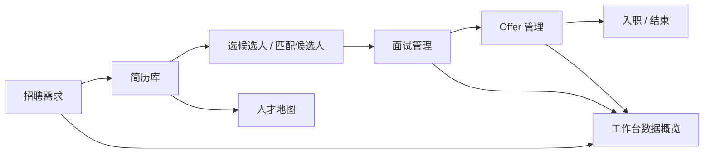

# 智聘产品交互逻辑文档

> 更新时间：2026-07-23
> 适用范围：当前本地演示版本的前端主流程与页面交互。
> 说明：本文从“用户点哪里、看到什么、系统做什么、数据怎么变”的角度整理，不替代 PRD、SDD、接口文档或上线清单。

## 1. 文档目的

当前项目已经有 PRD、系统设计和发布文档，但缺少一份给产品、设计和开发共同看的“页面交互说明”。这份文档用于回答：

- 左侧每个模块到底解决什么问题。
- 用户从一个页面怎么进入另一个页面。
- 每个按钮、筛选、弹窗、抽屉应该怎么响应。
- 哪些数据来自真实接口，哪些只是当前演示 Mock 数据。
- 空数据、失败、误操作时用户下一步应该怎么办。

几个简单词先统一：

- **页面**：浏览器地址变化的一整页，例如 `/demands` 招聘管理。
- **弹窗**：盖在当前页面上的小窗口，例如创建招聘需求。
- **抽屉**：从右侧滑出来的详情面板，例如岗位详情、面试处理。
- **Mock 数据**：为了演示效果补的假数据，不等于后端真实保存。

## 2. 产品总逻辑

智聘当前的主线是“一张招聘需求单带着候选人往前走”。

业务口径：

- 招聘需求是主线。一条需求代表一次真实招聘责任，不是简单职位模板。
- 简历先进入简历库，再被加入某个招聘需求。
- 面试管理负责候选人的面试排期、调整、轮次和处理动作。
- Offer 管理展示 Offer 审批、发放、回复、入职状态。
- 工作台负责把待办、岗位进展和统计入口聚合起来。
- AI 助手只做解析、匹配、总结和建议，不直接替用户推进、淘汰、发 Offer。

## 3. 角色与入口

| 角色 | 左侧入口 | 核心任务 |
|---|---|---|
| 招聘专员 | 工作台、招聘管理、简历库、人才地图、面试管理、AI 助手 | 建需求、导简历、选候选人、安排面试、推进流程 |
| 招聘经理/负责人 | 工作台、招聘管理、简历库、人才地图、面试管理、Offer 管理、AI 助手 | 看团队进度、处理卡点、看 Offer 与入职状态 |
| 管理员 | 以上入口 + AI 调用日志、系统设置 | 管账号、看审计、看外部接口状态 |
| 面试官 | 工作台、我的面试、候选人详情 | 看分配给自己的面试并提交反馈 |

权限边界：

- 左侧菜单隐藏不是安全边界，真正权限以后端校验为准。
- 招聘专员主要看自己负责的数据。
- 面试官不进入全量简历库，不直接推进流程、Offer 或淘汰。
- 管理员不能把自己停用或降级。

## 4. 全局交互规则

页面通用规则：

- 表格列名带下拉箭头时，点击后必须能筛选或排序，不只是展示一个菜单。
- 列表里的候选人姓名、岗位名称、阶段数字应优先做成可点击入口。
- 重要详情优先用弹窗或右侧抽屉，不强行跳走，避免用户丢失当前筛选现场。
- 全屏弹窗和右侧抽屉必须以浏览器窗口为准，内容过长时内部可滚动。
- 点击遮罩、右上角关闭、`Esc` 都应能关闭弹窗；保存中不能误关。
- 写操作要有反馈：成功提示、失败原因、按钮 loading、必要时防重复点击。
- 空列表不只说“暂无数据”，要告诉用户下一步：新建需求、导入简历、调整筛选或联系管理员。

## 5. 工作台

路由：`/`

目标：让招聘用户一进来就知道今天要处理什么，以及能快速跳到对应页面。

当前主要区域：

- 顶部状态卡：在招岗位、当前流程人数、待补反馈、本周新增简历。
- 待处理事项：今天面试、待处理结果、待面试反馈、Offer/谈薪等。
- 我的岗位进展：每个岗位的 HC、筛选、面试、Offer、入职数据。
- 简历来源分布、阶段分布、招聘业绩统计。

交互逻辑：

- 顶部状态卡点击后跳转对应页面：
  - 在招岗位 → `/demands?status=active`
  - 当前流程人数 → `/pipeline`
  - 待补反馈 → `/interviews?focus=pending`
  - 本周新增简历 → `/upload`
- 待处理事项每一行都应是任务入口，点击跳到面试、流程或 Offer 管理。
- “我的岗位进展”和“待处理事项”允许收起/展开。
- “查看全部”进入招聘管理或对应统计页。
- 快捷按钮：
  - 新增招聘需求 → `/demands`
  - 导入简历 → `/upload`
  - 去简历库 → `/candidates`
  - 发起 Offer → `/bi`

当前数据说明：

- 工作台当前主要是前端演示数据。
- 后续若接真实统计，需要以 Demand、候选人当前流程、面试反馈和 Offer 状态为准。

## 6. 招聘管理

路由：`/demands`

目标：管理所有招聘需求，并从需求直接进入“选候选人”“看流程”“看详情”。

页面结构：

- 顶部状态栏：全部、需求待确认、招聘中、已完成、已关闭。
- 右上角按钮：招聘需求。
- 搜索框：按需求编号、职位或负责人搜索。
- 表格列：需求/职位、部门与城市、负责人、HC/截止日期、阶段进度、状态、操作。

交互逻辑：

- 状态栏点击后筛选列表。
- 搜索框输入后过滤需求编号、职位、部门、城市、负责人、备注等文本。
- 部门与城市列下拉：筛选部门或城市。
- 负责人列下拉：筛选招聘负责人。
- 阶段进度数字可点击：
  - 业务待反馈 → `/pipeline?demand=<id>&stage=business_review`
  - 面试中 → `/pipeline?demand=<id>&stage=interview`
  - Offer 中 → `/pipeline?demand=<id>&stage=offer`
- 状态列下拉：筛选全部、待确认、招聘中、已完成、已关闭。
- 点击需求标题 → `/demands/<id>` 进入需求详情。
- 点击“选候选人” → 打开选择候选人弹窗。
- 已完成或已关闭需求显示“查看候选人”，用于只读查看。

创建招聘需求弹窗：

- 入口：右上角“招聘需求”。
- 表单内容：职位名称、所属部门、招聘城市、HC 人数、招聘负责人、招聘周期、紧急程度、岗位 JD。
- JD 模板：空白自定义、技术岗模板、产品岗模板、设计岗模板。
- 提交成功：关闭弹窗，刷新需求列表。
- 提交失败：保留已填内容，显示字段错误。
- 防重复：提交时锁按钮，接口带幂等 key。

选择候选人弹窗：

- 入口：需求行右侧“选候选人”。
- 顶部显示本次加入岗位、部门、城市、需求编号。
- 搜索：姓名、职位、技能标签。
- 基础筛选：期望工作城市、加入状态。
- 更多筛选：简历来源、期望岗位、工作年限、学历、负责人、简历更新时间。
- 排序：岗位匹配度、最近更新、最近入库。
- 候选人表格：勾选候选人、查看来源、当前阶段、匹配度、状态说明。
- 底部动作：
  - 下一步：推送面试官评审。
  - 仅加入岗位。
  - 导入简历：打开本机文件选择器。
  - 去简历库查看更多。

当前数据说明：

- 招聘管理把后端真实需求和前端 Demo 需求合并展示。
- Demo 需求的“加入候选人”只给演示提示，不写入数据库。
- 真实需求会调用后端接口加入流程、导入简历和刷新列表。

## 7. 简历库

路由：`/candidates`

目标：作为候选人主档案池，支持搜索、筛选、查看流程、加入岗位。

页面结构：

- 顶部按钮：导入简历、猎头推荐导入、导出。
- 状态栏：全部候选人、招聘流程中、人才池、已结束。
- 搜索框：搜索候选人姓名、职位。
- 更多筛选：目标招聘需求、意向城市、来源渠道、入流程状态、解析状态。
- 表格列：候选人、当前/最近应聘岗位、候选人状态、来源、招聘负责人、最近动态、操作。

交互逻辑：

- 状态栏点击后筛选，不只是展示数量。
- 表头下拉可筛选：
  - 当前/最近应聘岗位。
  - 候选人状态。
  - 来源。
  - 招聘负责人。
  - 最近动态。
- 中文输入法输入时不应在拼音组合中频繁搜索，确认输入后再查询。
- 候选人姓名：
  - 真实候选人 → `/candidates/<id>` 候选人详情页。
  - Mock 候选人 → 当前演示跳到面试管理定位候选人。
- “查看流程” → 候选人详情或面试管理。
- “加入岗位”：
  - 必须先在更多筛选里选择目标招聘需求。
  - Demo 候选人只显示模拟加入提示。
  - 真实候选人调用批量加入流程接口。

候选人详情页：

- 路由：`/candidates/<id>`
- 核心页签：
  - 原始简历：候选人事实真源。
  - 结构化画像：AI 解析结果，可人工编辑。
  - 匹配分析：基于当前需求或岗位的匹配建议。
- 招聘动作：
  - 切换当前操作需求。
  - 推进下一阶段。
  - 安排面试。
  - 记录 Offer。
  - 淘汰/原因。
  - 修正阶段。
  - 转派负责人。
- 候选人详情不应被 AI 结构化结果覆盖原始简历。

当前数据说明：

- 简历库会先读取真实候选人，不足 33 条时补 Mock 候选人用于演示。
- Mock 候选人不是真实候选人档案，不能作为生产数据判断。

## 8. 人才地图

路由：`/talent-map`

目标：不是简历列表，而是把目标公司、部门、岗位层级和潜在人选按结构摆出来，帮助招聘主动做市场盘点。

页面结构：

- 面包屑：简历库 > 人才地图。
- 新增目标公司表单：公司名称、行业分类、新增目标公司。
- 搜索：公司、部门、岗位。
- 行业筛选：物流/快递、互联网/科技、制造业、零售消费等。
- 公司卡片：展示目标盘点人数、确认人数、进度条。
- 公司详情：简介、来自简历库自动映射人数、岗位节点数量、目标盘点人数。
- 部门树：按部门展示岗位节点。

交互逻辑：

- 切换行业：展示该行业公司，并默认选中第一个公司。
- 点击公司卡片：切换当前公司详情。
- 新增目标公司：加入当前页面公司列表，并切换到新公司。
- 新增岗位节点：填写岗位名、候选人/代号、所属部门后添加到部门树。
- 部门右上角加号：快速指定新节点要放入的部门。
- 节点状态可调整：已确认、推测中、待填充。

当前数据说明：

- 当前人才地图主要使用前端本地状态，刷新页面后新增公司/节点会丢失。
- 后端已有 talent map API 客户端入口，但当前页面尚未接入真实持久化。

## 9. 面试管理

路由：`/pipeline`

目标：围绕一个招聘需求，处理候选人的面试排期、调整、轮次和详情查看。

页面结构：

- 当前招聘需求选择器。
- 操作入口：添加候选人、去匹配更多候选人。
- 搜索框：搜索候选人、岗位、面试官。
- 视图切换：列表、日历。
- 表格列：候选人、应聘岗位、城市、部门、面试轮次、面试安排、操作。

筛选逻辑：

- 候选人列：筛选具体候选人。
- 应聘岗位列：展示当前需求岗位。
- 城市列：筛选城市。
- 部门列：筛选部门。
- 面试轮次列：筛选全部、一面、二面、三面、HR 面。
- 面试安排列：筛选全部、尚未安排、已安排。
- 操作列：筛选待安排或待调整。

可点击信息：

- 候选人姓名 → 候选人详情小弹窗。
- 岗位名称 → 当前岗位详情右侧抽屉。
- 城市、部门、轮次、面试安排 → 候选人详情小弹窗。
- 日历卡片里的候选人和岗位也应能打开相同详情。

候选人详情小弹窗：

- 展示候选人、岗位、城市、部门、轮次、面试官、面试时间等基础信息。
- 点击“处理面试”进入右侧处理抽屉。
- 不跳转页面，避免打断当前面试列表。

岗位详情右侧抽屉：

- 展示岗位状态、部门、城市、招聘负责人、计划招聘、已入职、剩余 HC、招聘日期等。
- 页签：岗位信息、候选人、招聘进展。
- 候选人页签里可进入候选人详情。
- 可直接进入“处理面试”。

处理面试右侧抽屉：

- 展示候选人当前面试状态。
- 可调整面试轮次：一面、二面、三面、HR 面。
- 支持回退轮次，例如从二面回到一面。
- 主要按钮：
  - 尚未安排：安排面试。
  - 已安排未反馈：调整面试、催面试官补反馈、确认已完成、未进行。
  - 已反馈：处理结果、查看候选人档案。
- “查看候选人档案”打开候选人详情，不跳走。

调整面试弹窗：

- 可选面试官、面试日期、开始时间、预计时长、面试方式、会议室或会议链接。
- 通知与同步：同步企业微信日程、通知候选人、通知面试官。
- 保存后写入面试安排；失败时停留在弹窗并显示原因。
- 弹窗内容必须能顺畅滚动到底部。

当前数据说明：

- 如果当前需求没有真实候选人，页面会补一批演示候选人。
- 演示候选人的轮次调整主要在前端页面内生效。
- 真实保存面试安排会调用 `/interview/assignments`。

## 10. Offer 管理

路由：`/bi`，左侧菜单显示为“Offer 管理”。

目标：展示 Offer 从待提交、审批、发放、回复到入职/结束的状态。

页面结构：

- 右上角：发起 Offer。
- 状态栏：全部、待提交、审批中、待发放、待回复、待入职、已结束。
- 搜索：候选人、岗位。
- 更多筛选：产品部、技术研发部、设计部、本周更新、8 月入职、高薪资段。
- 表格列：候选人、应聘岗位、薪酬/入职日期、当前进度、最新动态、操作。

交互逻辑：

- 状态栏点击后筛选。
- 搜索框按候选人和岗位筛选。
- 表头下拉可筛选：
  - 候选人。
  - 应聘岗位。
  - 薪酬/入职日期。
  - 当前进度。
  - 最新动态。
- 候选人姓名点击 → `/candidates/<id>`。
- 操作按钮按状态变化：
  - 待提交：编辑并提交。
  - 审批中：等待审批。
  - 待发放：发放 Offer。
  - 待回复：跟进回复。
  - 待入职：确认入职。
  - 已结束：查看结果。

当前数据说明：

- 当前 Offer 管理使用前端 Mock 数据。
- 这些按钮目前主要承担演示状态入口，后续需要接真实 Offer 审批、发放、回传和入职接口。
- 真正的 Offer 发放和电子签按目标态应复用公司现有系统，智聘负责发起和展示状态。

## 11. 上传简历

路由：`/upload`

目标：把 PDF、DOCX、ZIP 等简历先保存到简历库，不强制立刻选择岗位。

交互逻辑：

- 选择文件后上传，成功项进入简历库。
- 失败项显示原因。
- 上传成功后可跳到简历库分配岗位。
- 旧版 `.doc` 文件因安全风险跳过。
- 误导入后续应按上传批次撤回。

## 12. 我的面试

路由：`/interviews`

目标：面试官处理自己的面试任务；招聘角色也可从待办深链进入。

交互逻辑：

- 面试官登录后主要看到待我处理、面试记录、反馈建议通过、反馈建议不通过。
- 点击任务进入反馈或查看详情。
- 面试反馈只完成本轮，不自动推进候选人到 Offer 或淘汰。
- 未分配或已取消任务不能提交反馈。

## 13. AI 助手

路由：`/agent`

目标：给招聘用户提供只读查询、总结和建议。

交互边界：

- 可以查候选人、需求、岗位、流程、BI 摘要。
- 可以解释卡点和建议下一步。
- 不允许直接创建/关闭 Demand、推进/淘汰候选人、发 Offer、转派负责人。
- 所有读取也要遵守当前账号权限。

## 14. 系统设置与审计

主要入口：

- `/admin/users`：账号管理。
- `/admin/settings`：系统设置。
- `/admin/agent-logs`：AI 调用日志。

交互逻辑：

- 管理员可以创建账号、启停账号、改角色、重置密码。
- 审计日志用于查看候选人查看/导出/删除、AI 解析产物、越权 403、高频导出等。
- 系统设置里的外部接口面板只展示“是否接通、当前模式、负责人、待补资料”，不代表接口已经真实打通。

## 15. 页面跳转关系

| 从哪里 | 用户动作 | 到哪里 |
|---|---|---|
| 工作台状态卡 | 在招岗位 | `/demands?status=active` |
| 工作台状态卡 | 当前流程人数 | `/pipeline` |
| 工作台状态卡 | 待补反馈 | `/interviews?focus=pending` |
| 工作台状态卡 | 本周新增简历 | `/upload` |
| 招聘管理 | 点击需求标题 | `/demands/<id>` |
| 招聘管理 | 点击阶段数字 | `/pipeline?demand=<id>&stage=<stage>` |
| 招聘管理 | 选候选人 | 当前页弹窗 |
| 选候选人弹窗 | 去简历库查看更多 | `/candidates?demand=<id>` |
| 简历库 | 点击真实候选人 | `/candidates/<id>` |
| 简历库 | 加入岗位 | 当前页写入/提示 |
| 面试管理 | 点击候选人 | 当前页候选人详情弹窗 |
| 面试管理 | 点击岗位 | 当前页岗位详情抽屉 |
| 面试管理 | 处理面试 | 当前页右侧处理抽屉 |
| 面试处理抽屉 | 安排/调整面试 | 当前页调整面试弹窗 |
| Offer 管理 | 点击候选人 | `/candidates/<id>` |
| 人才地图 | 新增公司/节点 | 当前页更新本地视图 |

## 16. 数据来源与落库状态

| 模块 | 当前数据来源 | 是否真实写后端 | 备注 |
|---|---|---:|---|
| 登录 | 后端 `/auth/login` | 是 | 账号密码登录后存 token |
| 工作台 | 前端演示数据 | 否 | 后续应接统计接口 |
| 招聘管理 | 后端需求 + Demo 需求 | 部分是 | Demo 需求不写库 |
| 创建招聘需求 | 后端 `/demands` | 是 | 带幂等 key |
| 选候选人 | 后端候选人 + 匹配预览 | 真实需求写库 | Demo 需求只提示 |
| 简历库 | 后端候选人 + Mock 补齐 | 部分是 | Mock 不能当真实档案 |
| 导入简历 | 后端 `/resume/upload` | 是 | 文件选择器上传 |
| 人才地图 | 前端本地状态 | 否 | 刷新后新增内容丢失 |
| 面试管理 | 后端流程 + Demo 候选人 | 部分是 | 真实安排写 assignment |
| 调整面试 | 后端 `/interview/assignments` | 是 | 演示轮次覆盖是前端状态 |
| Offer 管理 | 前端 Mock 数据 | 否 | 后续接 OA/Offer/HRIS |
| AI 助手 | 后端 Agent API | 是/只读为主 | 不允许主流程写操作 |

## 17. 空态与异常处理

| 场景 | 用户应该看到 | 下一步 |
|---|---|---|
| 没有招聘需求 | 暂无招聘需求 | 新建招聘需求 |
| 招聘需求筛选无结果 | 没有符合条件的招聘需求 | 调整状态/筛选，或新增 |
| 简历库无结果 | 没有符合条件的简历 | 调整搜索、导入简历 |
| 选候选人无结果 | 没有符合条件的候选人 | 导入简历或去简历库查看更多 |
| 面试管理无候选人 | 当前需求中暂无候选人 | 添加候选人或去匹配更多候选人 |
| 日历无已安排面试 | 当前筛选下暂无已安排面试 | 切回列表继续安排 |
| Offer 无结果 | 当前筛选下暂无 Offer | 调整筛选条件 |
| 接口失败 | 数据暂不可用/展示真实错误 | 重试，不伪装成 0 |

## 18. 后续补齐建议

优先级按演示和试点风险排序：

1. Offer 管理接真实后端状态，至少支持发起、审批中、待发放、待回复、待入职、已结束的状态流。
2. 人才地图接后端持久化，新增公司、节点和状态调整刷新后不丢失。
3. 工作台统计改为真实接口，不再只用前端演示数字。
4. 招聘管理“阶段进度”表头菜单从演示菜单升级为真实排序或筛选。
5. 面试管理里的轮次回退需要后端明确记录原因和审计，不能只存在前端页面状态。
6. 所有全屏弹窗和右侧抽屉统一做视口级滚动验收，避免再次出现滑不下去、底部被遮挡的问题。
7. Mock 数据需要有清晰标识或只在演示模式启用，防止试点时误当真实数据。
