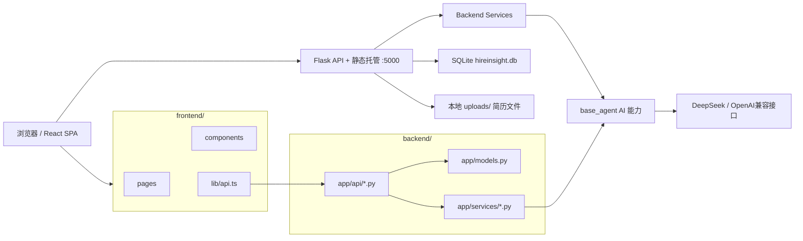
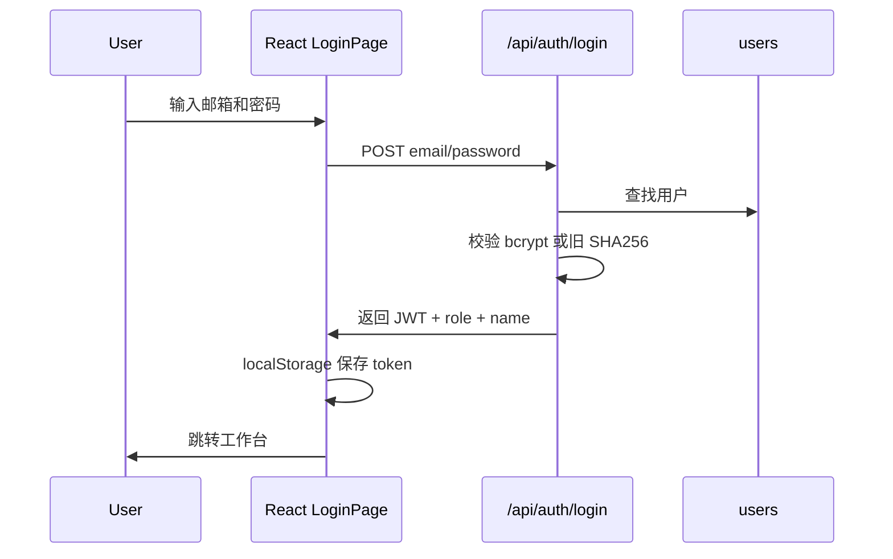
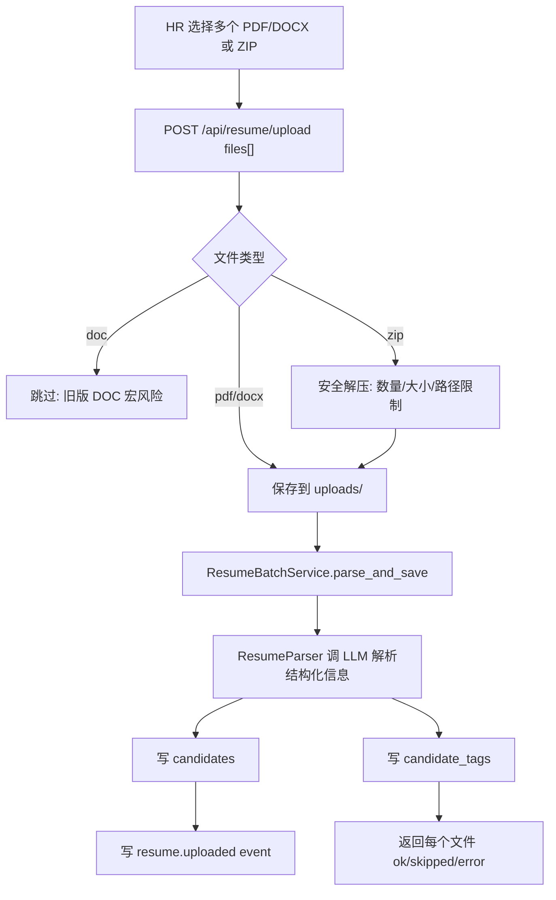

# 智聘招聘系统 SDD v1.1（Demand-scoped As-built 代码候选）

> As-built SDD = 根据当前已实现系统反推的系统设计文档。
> 本文用于后续迭代开发、模块定位、影响范围评估和交接，不等同于最初立项时的需求文档。
>
> **2026-07-22 当前状态：** 本地 Codex 功能候选 `codex/readdy-test-product` 基于远端 `test` `5e251a2`，功能候选 SHA `5ef064a`。当前未 push、未进入 Libra 构建/部署、未在 SIT 生效；本文不声称 SIT 已运行本候选。环境是否完整具备该能力，仍以后端受控 API、schema revision、部署记录和页面现场验收为准。
>
> **2026-07-11 历史状态：** Demand 维度招聘流及当轮 P0 硬化曾在 `codex/premerge-p0-closeout-20260711` 形成代码候选；该记录不是当前候选指针。

## 1. 文档基准

| 项目 | 内容 |
|---|---|
| 系统名称 | 智聘 · 招聘管理系统 |
| 文档类型 | 当前代码候选 As-built 与尚未完成的环境/Strict 门禁合并文档 |
| 代码基准 | 本地 Codex 功能候选 `codex/readdy-test-product`，基于远端 `test` `5e251a2`，功能候选 SHA `5ef064a`；当前未 push、未 Libra、未 SIT；设计决策见 ADR-0002 |
| 本地项目路径 | `/Users/yenns/Documents/新版招聘/zhipin-mvp` |
| 主要用途 | 后续按模块指定改动时，用来快速判断要改哪些文件、影响哪些接口/表/流程 |
| 文档生成日期 | 2026-06-19；Demand As-built 更新于 2026-07-11 |

### 1.1 实现状态分层

| 层级 | 含义 | 对外可宣称范围 |
|---|---|---|
| 当前代码候选 | Job 是可复用岗位画像，Demand 是一次具体招聘任务；主流程、面试、负责人与 BI 按 `demand_id` 归属 | 可说“本地实现和自动化验证完成”，不能说已推送、已部署或可生产上线 |
| CFPD 代码源 | CFPD `test` 实际 SHA | 只证明 Libra 可读取的代码，不证明已构建/部署 |
| SIT 运行态 | Libra CommitID/镜像、部署日志、schema revision、受控 API、前端资产和四角色冒烟 | 证据齐全后才可说环境已生效 |
| P1 后续 | 打印、归档及其他非 P0 能力 | 仅作路线图，本轮不实现、不验收 |

### 1.2 本地兼容补丁说明

当前本地代码除云端 `main` 外，还保留了几处运行兼容补丁：

| 文件 | 目的 |
|---|---|
| `backend/app/api/auth.py` | 兼容旧演示数据库中的 SHA256 密码；公开注册默认关闭，试点账号由 admin 分配 |
| `base_agent/llm_client.py` | 支持 `keychain:<service>` 形式读取 macOS 钥匙串中的 API Key |
| `base_agent/resume_parser.py` | 简历解析器也支持钥匙串 API Key，避免上传简历时把 `keychain:` 字符串当作真实 key |
| `backend/tests/test_auth_passwords.py` | 覆盖 bcrypt 与旧 SHA256 密码兼容 |
| `base_agent/tests/test_llm_client_secrets.py` | 覆盖钥匙串密钥解析和简历解析器密钥路径 |
| `backend/migrate_stages.py` | 将历史一面/二面/终面主流程阶段归并为当前 MVP 的 `interview` |

这些补丁是为了让本地演示环境稳定运行。若后续要推到云端，应作为单独 PR 合入，并同步更新 `.env.example` / 部署文档。

## 2. 系统目标

智聘是一个面向招聘团队的内部招聘管理系统，核心目标是把“简历进入、岗位管理、候选人匹配、流程推进、AI 面试、BI 看板”串成一条可操作的招聘闭环。

### 2.1 核心能力

| 能力 | 当前状态 | 说明 |
|---|---|---|
| 登录与角色权限 | 已实现 | JWT + RBAC，角色包括 admin / manager / recruiter / interviewer |
| 候选人库 | 已实现 | 列表、详情、候选人判断卡片、辅助雷达、折叠全量技能标签、候选人归属、受控 CSV 导出 |
| 简历上传解析 | 已实现 | PDF / DOCX / ZIP 批量上传，旧版 DOC 因宏风险跳过，AI 解析入库 |
| 岗位管理 | 已实现 | 创建、编辑、关闭岗位，JD AI 结构化与澄清追问 |
| 智能匹配 | 已实现 | 岗位找候选人，生成匹配分、命中标签、缺失标签 |
| 候选人流程 | 代码候选已实现，环境待验收 | 主阶段枚举保持稳定；归属键为 `demand_id`，转需求使用 `transferred` |
| AI 面试 | 代码候选已实现，环境待验收 | 保留生成题目、评分与建议；AI 不自动推进、淘汰、发 Offer、转派或关闭需求 |
| 面试官反馈 | 代码候选已实现，环境待验收 | 按 Demand/assignment/轮次写反馈，数据库约束防并发重复，进入候选人 journey |
| BI 看板 | 代码候选已实现，环境待验收 | 按 Demand 看进度、瓶颈与当前责任协同；不返回人员排名、绩效或奖金依据 |
| AI 助手 | 代码候选已收缩，环境待验收 | 只做解析、匹配、总结与建议，不提供主流程写操作 |
| 用户管理 | 已实现 | admin 管理用户角色、启停、创建账号与重置密码 |

### 2.2 明确不做或尚未工程化的能力

| 项目 | 当前状态 |
|---|---|
| 多组织隔离 | 已实现核心 `org_id` 隔离；一期不提供前端组织管理后台 |
| 试点审计 | 已实现试点版 | 关键查看、导出、写操作、AI 写操作和越权 403 记录到 `events`；管理员页对越权和高频导出告警标红 |
| 异步任务队列 | 配置了 Celery eager，但当前上传/AI 多为同步处理 |
| 搜索索引 | 未实现，主要通过数据库查询 |
| 大规模批量导入队列 | 未实现，当前批量上传在请求中同步解析 |
| 文件对象存储 | 未实现，简历原文件保存在本地上传目录 |

术语说明：本文中的“多组织隔离”指核心业务数据通过 `org_id` 做服务端过滤和越权拦截。“不做 SaaS 式多租户”指一期不做前端组织管理后台、租户自助开通、跨组织运营管理、计费/套餐等能力；不应理解为当前没有组织级数据隔离。

## 3. 总体架构



### 3.1 技术栈

| 层 | 技术 |
|---|---|
| 前端 | React, TypeScript, Vite, Tailwind CSS, lucide-react, GSAP |
| 后端 | Flask, Flask-SQLAlchemy, Flask-CORS, PyJWT, bcrypt |
| 数据库 | SQLite 开发/演示；试点/生产可替换为 MySQL 或 PostgreSQL |
| AI | `base_agent/llm_client.py`，OpenAI 兼容 Chat Completions，当前配置 DeepSeek |
| 智能体 | LangGraph ReAct 循环，SSE 流式输出 |
| 部署 | Flask 单端口托管 `frontend/dist`；也支持 gunicorn |

### 3.2 单端口部署模式

后端 `backend/app/__init__.py` 注册了 API 蓝图，同时把 `frontend/dist` 作为 SPA 静态文件托管：

| 路径 | 处理方式 |
|---|---|
| `/api/*` | Flask 蓝图 API |
| `/assets/*` | 返回前端构建产物 |
| `/login`、`/candidates` 等前端路由 | 回退 `frontend/dist/index.html` |

这意味着本地生产式运行只需要：

```bash
cd frontend
npm run build

cd ../backend
python run.py
```

或使用 gunicorn：

```bash
cd backend
gunicorn -w 2 -b 0.0.0.0:5000 --timeout 120 --keep-alive 5 "run:app"
```

## 4. 目录结构与职责

| 路径 | 责任 |
|---|---|
| `frontend/src/App.tsx` | 前端路由与角色级页面守卫 |
| `frontend/src/lib/api.ts` | 所有前端 API 调用、JWT 注入、401 处理 |
| `frontend/src/lib/auth.tsx` | 登录态、token、角色信息 |
| `frontend/src/lib/nav.ts` | 侧边导航与角色可见性 |
| `frontend/src/pages/*` | 页面级功能 |
| `frontend/src/components/*` | 通用 UI、业务组件、看板组件 |
| `backend/run.py` | 后端启动入口 |
| `backend/app/__init__.py` | Flask app、蓝图注册、前端静态托管 |
| `backend/app/config.py` | 环境变量、数据库、上传目录、JWT、Celery 配置 |
| `backend/app/models.py` | 数据模型定义 |
| `backend/app/api/*.py` | REST API 层 |
| `backend/app/services/*.py` | 业务服务层，封装匹配、简历、面试、AI 助手等 |
| `backend/app/middleware/auth.py` | JWT 校验与 RBAC 装饰器 |
| `backend/app/middleware/events.py` | 写操作事件埋点 |
| `base_agent/llm_client.py` | LLM 请求、模型路由、密钥读取 |
| `base_agent/resume_parser.py` | 简历解析与技能标签抽取 |
| `base_agent/job_matcher.py` | 岗位-候选人匹配算法 |
| `backend/seed_dev.py` | 演示数据重置脚本 |
| `frontend/dist/` | 前端生产构建产物，由 Flask 托管 |

## 5. 角色与权限模型

中文角色名以 `docs/README.md` 的“角色名口径”为准。代码和权限判断只认 `admin`、`manager`、`recruiter`、`interviewer` 四类技术角色；旧称或业务别名里的“招聘主管 / HRD / 招聘负责人 / 用人部门负责人”在权限上统一按 `manager` 理解，“HR 专员”按 `recruiter` 理解，“系统管理员”按 `admin` 理解。

| 角色 | 可见模块 | 主要权限 |
|---|---|---|
| `admin` | 工作台、AI 助手、候选人、上传、岗位、流程、BI、系统设置 | 当前组织内用户管理、BI、候选人、岗位、流程、AI 助手；面试任务通过工作台待办或候选人流程深链进入 |
| `manager` | 工作台、AI 助手、候选人、上传、岗位、流程、BI | 当前组织内团队视角管理、候选人转派、BI 查看；面试任务通过工作台待办或候选人流程深链进入 |
| `recruiter` | 工作台、AI 助手、候选人、上传、岗位、流程 | 仅负责自己的候选人和岗位；不能查看或操作别人负责的岗位；面试任务通过工作台待办或候选人流程深链进入 |
| `interviewer` | 工作台、我的面试、候选人详情 | 只处理分配给自己的面试安排与反馈；不浏览全量简历库、不推进候选人流程、不使用 AI 助手 |

### 5.1 前端路由守卫

前端入口：`frontend/src/App.tsx`

| 路由 | 页面 | 角色 |
|---|---|---|
| `/login` | `LoginPage` | 未登录 |
| `/` | `DashboardPage` | 全部登录角色 |
| `/agent` | `AgentPage` | recruiter / manager / admin |
| `/notifications` | `NotificationCenterPage` | 全部登录角色 |
| `/candidates` | `CandidatesPage` | recruiter / manager / admin |
| `/candidates/:id` | `CandidateProfilePage` | recruiter / manager / admin / interviewer |
| `/upload` | `UploadPage` | recruiter / manager / admin |
| `/jobs` | `DemandsPage` （Readdy 招聘管理别名） | recruiter / manager / admin |
| `/job-templates` | `JobsPage` （岗位/JD 二级能力） | recruiter / manager / admin |
| `/interviewer/dashboard`, `/interviewer/interviews`, `/interviewer/screening` | `DashboardPage`, `InterviewListPage` | interviewer |
| `/interviewer/candidates`, `/interviewer/jobs` | `InterviewerScopePage` （仅 assignment 范围） | interviewer |
| `/director/cockpit`, `/director/progress`, `/director/insights` | `DashboardPage`, `BiPage` | manager / admin |
| `/director/approvals` | `OffersPage` （真实 Offer 状态机） | manager / admin |
| `/jobs/:id/match` | `JobMatchPage` | recruiter / manager / admin |
| `/talent-map` | `TalentMapPage` | recruiter / manager / admin |
| `/pipeline` | `PipelinePage` | recruiter / manager / admin |
| `/interviews` | `InterviewListPage` | recruiter / interviewer / manager / admin |
| `/interviews/new` | `InterviewsPage` | recruiter / manager / admin |
| `/interviews/:id` | `InterviewReportPage` | recruiter / manager / admin / interviewer |
| `/bi` | `BiPage` | manager / admin |
| `/admin/users` | `UsersPage` | admin |
| `/admin/settings` | `SystemSettingsPage` | admin |
| `/admin/ai-architecture` | `AiArchitecturePage` | admin |

### 5.2 后端权限

后端使用 `require_auth` 解 JWT，再从数据库读取用户，把 `user_id`、`role` 与 `org_id` 写入 Flask `g`。部分接口通过 `require_role(...)` 限制角色。

以下是当前代码候选的权限行为：

- 前端隐藏菜单不是安全边界，后端 RBAC 才是安全边界。
- `recruiter` 在候选人、流程、面试和 BI 上以 `demand_id`、Demand owner 和当前组织校验；AI 工具目录不含主流程写能力。
- `manager`、`admin` 只能看当前组织内数据；一期不提供跨组织管理后台。
- 已存在 Demand 的流程/面试写入权限由 Demand 状态和 Demand RBAC 决定，不由 Job 状态反向决定；只有 legacy job-only 上下文需要先唯一解析 Demand。
- `admin` 不能停用或降级自己的账号。

## 6. 数据模型

源文件：`backend/app/models.py`

| 表 | 模型 | 关键字段 | 用途 |
|---|---|---|---|
| `users` | `User` | `org_id`, `name`, `email`, `role`, `password_hash`, `is_active`, `token_version` | 用户、角色、启停；`org_id` 是多组织隔离边界；改密/重置密码、角色或启停变化递增 `token_version` 让旧 token 失效 |
| `candidates` | `Candidate` | `org_id`, `owner_hr_id`, `current_demand_id`, `name_masked`, `resume_json`, `raw_file_path`, `deleted_at`, `deleted_by`, `anonymized_at` | 候选人主档与当前唯一活跃 Demand 指针；支持软删除与匿名化 |
| `upload_batches` | `UploadBatch` | `org_id`, `owner_hr_id`, `target_job_id`, `demand_id`, `source_channel`, `note` | 批量上传元数据；误导入撤回按批次定位候选人 |
| `candidate_tags` | `CandidateTag` | `org_id`, `candidate_id`, `tag`, `score` | 简历技能标签及评分 |
| `jobs` | `Job` | `org_id`, `title`, `jd_text`, `jd_structured`, `owner_hr_id`, `status` | 岗位主档与结构化 JD |
| `matches` | `Match` | `org_id`, `job_id`, `candidate_id`, `score`, `reason` | 持久化的岗位匹配结果 |
| `interviews` | `Interview` | `org_id`, `candidate_id`, `job_id`, `demand_id`, `qa_json`, `ai_report`, `score`, `pass_recommended` | Demand 下 AI 面试记录与评分；不自动改流程 |
| `pipeline_stages` | `PipelineStage` | `org_id`, `candidate_id`, `job_id`, `demand_id`, `stage`, `updated_by`, `note`, `ts` | Demand 招聘流程流水，append-only |
| `events` | `Event` | `org_id`, `actor_id`, `actor_role`, `action`, `entity_id`, `entity_type`, `payload`, `request_id`, `ip`, `user_agent`, `result`, `failure_reason`, `source`, `severity` | 写操作事件与试点审计基础；`source` 区分页面、AI、安全拦截 |
| `audit_logs` | `AuditLog` | `org_id`, `actor_id`, `target_table`, `target_id`, `action` | 预留审计表，当前使用较少 |
| `interview_feedback` | `InterviewFeedback` | `org_id`, `candidate_id`, `job_id`, `demand_id`, `assignment_id`, `round`, `interviewer_id`, `score`, `passed`, `reason_tags`, `note` | 具体 assignment 的面试反馈；`assignment_id` 非空时唯一 |
| `idempotency_records` | `IdempotencyRecord` | `scope_key`, `idempotency_key`, `actor_scope`, `method`, `path`, `body_hash`, `status_code`, `response_json` | 普通 JSON/表单写接口的 `Idempotency-Key` 重试保护；重放前重新校验当前账号启用状态与 `token_version` |

下列 Demand-scoped 模型和约束同样已存在于当前代码候选：

| P0 模型/表 | 关键字段或约束 | 唯一 Owner 语义 |
|---|---|---|
| `RecruitmentDemand` / `recruitment_demands` | `org_id`, `job_id`, `job_title_snapshot`, `jd_text_snapshot`, `city`, `department`, `headcount`, `owner_hr_id`, `default_interviewer_id`, `request_no`, `created_by`, `requested_at`, `accepted_at`, `target_date`, `status`, `closed_at`, `closed_by`, `close_reason`；`(org_id, request_no)` 唯一 | 具体招聘任务；同一 Job 允许并行或历史多个 Demand，Demand 状态不反向改写 Job 状态；默认面试官只是后续安排初值 |
| `Candidate` | 新增 `current_demand_id` | 候选人当前唯一活跃招聘流的快速定位指针，不替代历史流水 |
| `CandidateDemandFlow` / `candidate_demand_flows` | `org_id`, `candidate_id`, `demand_id`, `owner_hr_id`, `status`, `started_at`, `ended_at`, `transfer_from_demand_id`, `transfer_reason`；唯一约束 `(org_id, candidate_id, demand_id)` | 候选人在某 Demand 下的应聘关系与活动状态；当前阶段从该 Demand 的最新 `PipelineStage` 取得，P0 仅允许一个 active flow |
| 主流程与业务事实 | `pipeline_stages`, `interviews`, `interview_assignments`, `interview_feedback`, `offers`, `dispositions`, `events`, `notifications`, `upload_batches` 增加可回填的 `demand_id` | 所有业务事实在严格切换后按 Demand 归属；`job_id` 仅保留画像或兼容语义 |
| `InterviewAssignment` | `demand_id`, `round_sequence`, `is_primary`, `primary_slot`；唯一索引 `(org_id,demand_id,candidate_id,primary_slot)` | 有效 primary 的 `primary_slot=round_sequence`，辅助/取消安排为 NULL；数据库保证每轮最多一个有效主面试官 |
| `InterviewFeedback` | `assignment_id`, `demand_id`；`assignment_id` 唯一索引 | 反馈归属具体安排，同一 assignment 不产生第二份反馈；legacy NULL 仅为兼容，反馈永不自动推进主流程 |
| `Match` | 继续使用 `job_id` | 匹配是候选人与岗位画像的可复用计算；“加入哪个招聘任务”由 `demand_id` 决定 |

### 6.1 招聘阶段枚举

当前合法阶段：

```text
pending
ai_screen
business_review
interview
offer
onboarded
rejected
transferred
```

主流程顺序定义在 `backend/app/api/pipeline.py` 和 `frontend/src/lib/pipelineStages.ts`。新增阶段时必须两边同步。

历史兼容：`interview_first` / `interview_second` / `interview_final` 仍可被后端读取并归并展示为 `interview`，但新写入的候选人主流程不应再生成这些旧阶段。面试第几轮通过 `interview_feedback.round`、面试安排和面试记录表达，不再作为流程主阶段。

### 6.2 PipelineStage 的重要设计

`pipeline_stages` 是 append-only 流水表，不是“当前状态表”。候选人每推进一次就新增一行。当前代码按 `(candidate_id, demand_id)` 取最新一行，并与 active `CandidateDemandFlow`、`Candidate.current_demand_id` 做一致性校验；job-only 只在兼容入口唯一解析 Demand 后代理。

影响点：

| 改动 | 风险 |
|---|---|
| 直接按 `stage` group by | 会把历史阶段重复计入漏斗 |
| 删除历史阶段 | 会破坏 candidate journey 与 BI |
| 新增阶段 | 必须同步 `VALID_STAGES`、`STAGE_ORDER`、前端阶段配置、测试 |

P0 在现有主阶段之外增加流转终态 `transferred`，它仅表示该候选人已从源 Demand 转出，不等于 `rejected`，不进入淘汰口径。

## 7. 核心 API 清单

所有接口都挂在 `/api` 下。

写接口重试约定：

- 普通 JSON/表单写接口可带 `Idempotency-Key`。只有当前用户仍启用、JWT `token_version` 与数据库一致时，同一用户、同一路径、同一请求体、同一个 key 的重试才返回第一次 2xx JSON 结果，并带 `X-Idempotent-Replay: true`；角色/启停/密码变化后的旧 token 不能重放历史响应。
- 同一个 key 如果换了请求体，返回 409，避免“重试”变成另一次业务操作。
- multipart 简历上传不走通用请求体缓存，避免大文件内存压力；它使用文件指纹、来源信息和目标岗位做 10 分钟内业务级去重。
- 流程推进、面试排期、面试反馈有额外自然幂等逻辑，防止用户连点或接口重试产生重复业务记录。

### 7.1 Auth

| 方法 | 路径 | 权限 | 作用 |
|---|---|---|---|
| `POST` | `/auth/register` | 无 | 公开注册入口，默认关闭；试点账号由 admin 创建 |
| `POST` | `/auth/login` | 无 | 登录，返回 JWT、角色、姓名 |
| `GET` | `/auth/me` | 登录 | 获取当前用户 |
| `POST` | `/auth/change-password` | 登录 | 修改当前用户密码 |

### 7.2 Resume / Candidate

| 方法 | 路径 | 权限 | 作用 |
|---|---|---|---|
| `POST` | `/resume/upload` | recruiter/manager/admin | 批量上传 PDF / DOCX / ZIP 简历，AI 解析入库；旧版 `.doc` 跳过；旧调用若带 `target_job_id`，后端会校验岗位负责人、组织和在招状态；同一用户 10 分钟内重复上传同一批文件和来源信息时复用首次结果 |
| `POST` | `/resume/batches/<batch_id>/rollback` | 批次上传人/manager/admin | 撤回误导入批次，候选人软删除、匿名化、删除原文件并写审计 |
| `GET` | `/resume/<candidate_id>` | 登录 + 候选人可见权限 | 候选人简历详情与技能标签，返回 `owner_hr_id` 供负责人展示与转派 |
| `GET` | `/candidates` | 登录 | 候选人列表，recruiter 只看当前组织内自己负责的；`search` 会覆盖姓名、邮箱、电话、技能标签和简历解析 JSON 中的公司、岗位、学校等文本；软删除候选人不返回 |
| `GET` | `/candidates/owner-options` | manager/admin | 获取启用中的招聘专员下拉选项 |
| `GET` | `/candidates/<id>/pipelines` | 登录 | 候选人参与的招聘需求流程 |
| `GET` | `/candidates/<id>/journey?demand_id=` | 登录 + Demand 权限 | 候选人在具体 Demand 下的完整时间线、AI 面试和面试官反馈；兼容 `job_id` 仅在零/一/多 Demand 规则可唯一解析时代理 |
| `PATCH` | `/candidates/<id>/owner` | manager/admin | 转派候选人负责人，`reason` 必填并写入事件流水 |
| `GET` | `/candidates/<id>/export` | owner/manager/admin | 导出单个候选人 CSV，并写入 `candidate.exported` 审计事件；同一账号 10 分钟内第 6 次起标记 `severity=warning` |
| `DELETE` | `/candidates/<id>` | owner/manager/admin | 候选人软删除与匿名化，`reason` 必填；清空 PII、简历 JSON、原文件路径并删除原简历文件 |

### 7.3 Jobs / Match

| 方法 | 路径 | 权限 | 作用 |
|---|---|---|---|
| `POST` | `/jobs/clarify` | recruiter/manager/admin | AI 根据 JD 生成澄清追问，不落库 |
| `POST` | `/jobs` | recruiter/manager/admin | 创建岗位，AI 结构化 JD；岗位写入当前 `org_id` 且负责人为当前用户 |
| `GET` | `/jobs?status=active\|closed\|all` | 登录 | 岗位列表，默认 active；recruiter 仅看自己负责或历史未分配岗位 |
| `GET` | `/jobs/<job_id>` | 登录 | 岗位详情；跨组织返回不存在，非负责人 recruiter 返回 403 |
| `PUT` | `/jobs/<job_id>` | owner/manager/admin | 编辑岗位，JD 变化时重新结构化 |
| `POST` | `/jobs/<job_id>/close` | owner/manager/admin | 关闭岗位 |
| `POST` | `/jobs/<job_id>/restore` | owner/manager/admin | 将已关闭岗位恢复为在招 |
| `GET` | `/jobs/<job_id>/match-preview?candidate_ids=` | owner/manager/admin | 简历库和岗位匹配页的只读匹配预览，不写入 `matches` |
| `POST` | `/jobs/<job_id>/match` | owner/manager/admin | 运行岗位候选人匹配并持久化；关闭岗位拒绝 |
| `POST` | `/match` | owner/manager/admin | 兼容旧入口，按 `job_id` 运行匹配；关闭岗位拒绝 |

### 7.4 Recruitment Demands（当前代码候选）

| 方法 | 路径 | 权限 | 作用 |
|---|---|---|---|
| `GET` | `/demands` | recruiter/manager/admin | 查询当前账号可管理的用人需求 |
| `POST` | `/demands` | recruiter/manager/admin | 创建用人需求；可传 `job_id` 复用已有岗位画像，也可传 `job_title` + `jd_text` 自动创建岗位画像；`default_interviewer_id` 可空且必须是同组织启用账号 |
| `PATCH` | `/demands/<demand_id>` | owner/manager/admin | 更新需求可编辑字段，包括设置/清空 `default_interviewer_id`；状态、负责人和优先级命令仍走专用端点 |
| `POST` | `/demands/<demand_id>/close` | owner/manager/admin | 关闭、完成、暂停或取消 Demand；不反向修改 Job |
| `POST` | `/demands/<demand_id>/restore` | owner/manager/admin | 仅恢复 Demand，不反向修改 Job |
| `POST` | `/demands/<demand_id>/downgrade` | owner/manager/admin | 兼容旧降级入口，记录降级原因 |
| `PATCH` | `/demands/<demand_id>/owner` | manager/admin | 事务内转派 Demand 与 active flow 当前责任，不改 Job owner/历史 actor |

### 7.5 Pipeline（当前代码候选）

| 方法 | 路径 | 权限 | 作用 |
|---|---|---|---|
| `POST` | `/pipeline/demands/<demand_id>/move`（兼容 `/pipeline/move`） | recruiter/manager/admin；interviewer 禁止 | Demand RBAC 下推进，追加流水、更新 Flow 和审计；重复请求不追加重复事实 |
| `POST` | `/pipeline/demands/<source_demand_id>/transfer`（兼容 `/pipeline/transfer`） | recruiter/manager/admin；interviewer 禁止 | 单事务将来源写为 `transferred`、目标从 `pending` 承接，失败整体回滚 |
| `GET` | `/pipeline/demands/<demand_id>` | 登录且有 Demand 权限 | 具体 Demand 当前阶段人数 |
| `GET` | `/pipeline/demands/<demand_id>/board` | 登录且有 Demand 权限 | 具体 Demand 看板候选人卡片数据 |
| `GET` | `/pipeline/demands/<demand_id>/history/<candidate_id>` | 登录且有 Demand/候选人权限 | 候选人在具体 Demand 下的 append-only 历史；job-only 变体仅在唯一解析时代理 |

### 7.5.1 Offer 生命周期（当前代码候选）

| 方法 | 路径 | 权限 | 作用 |
|---|---|---|---|
| `PUT` | `/pipeline/demands/<demand_id>/offer/<candidate_id>` | Demand owner/manager/admin | 新建或编辑 `draft`；请求体中的状态字段不会绕过审批，已提交草稿返回 409 |
| `GET` | `/offers` | recruiter/manager/admin | 按组织和 Demand 可见范围列出 Offer；支持 `status` 和 `search` |
| `GET` | `/offers/<offer_id>` | recruiter/manager/admin + Demand 读取权 | 返回候选人、需求、当前状态、回复和 append-only 操作历史 |
| `POST` | `/offers/<offer_id>/actions` | Demand owner/manager/admin；审批/审批拒绝仅 manager/admin | 状态机动作：`submit/approve/reject/send/accept/decline/withdraw/expire/onboard/resend/follow_up`；支持 `Idempotency-Key`，关键动作写通用审计 |

Offer 状态顺序为 `draft → pending → approved → sent → accepted → onboarded`，审批拒绝或候选人拒绝进入 `declined`，在途记录可进入 `withdrawn`，超时可进入 `expired`。确认入职与候选人主流程推进到 `onboarded` 在同一事务完成；失败整体回滚。面试官不可访问 Offer 管理接口。

### 7.5.2 招聘流程口径（当前代码候选）

| 方法 | 路径 | 权限 | 作用 |
|---|---|---|---|
| `GET` | `/kpi-standards` | manager/admin | 读取当前组织的阻塞分类、Demand 风险和流程健康阈值；未自定义时返回默认值和版本 0 |
| `PUT` | `/kpi-standards` | manager/admin | 按 `version` 乐观锁保存组织级配置；校验分类、阈值和值域，冲突返回 409，写入审计 |
| `POST` | `/kpi-standards/reset` | manager/admin | 按当前 `version` 恢复默认值并增加版本，写入审计 |

该配置只作用于 Demand 流程提醒和阻塞分类，不得派生个人排名、专员健康分或绩效结论。正式前端不使用浏览器存储作为业务真源。

### 7.6 Interview（当前代码候选）

| 方法 | 路径 | 权限 | 作用 |
|---|---|---|---|
| `POST` | `/interview/start` | recruiter/manager/admin + Demand 权限 | 在显式/唯一解析的 Demand 上下文生成 AI 面试题；面试官禁止 |
| `POST` | `/interview/submit` | recruiter/manager/admin + Demand 权限 | 提交回答、保存 AI 评分与建议，不回写流程 |
| `GET` | `/interview/<interview_id>` | 登录 | AI 面试报告详情 |
| `POST` | `/interview/feedback` | 登录且有 Demand/assignment 权限 | 提交具体 assignment 反馈；同 assignment 重复返回已有反馈，数据库唯一索引为并发最终防线；任何反馈都不推进流程 |
| `GET` | `/interview/feedback` | 登录 | 查询反馈，返回原因分类 |
| `GET` | `/interviews` | 登录 | 面试记录列表，按角色过滤 |
| `GET` | `/interview/interviewers` | 登录 | 返回启用中的面试官/经理/管理员选项，包含姓名、email 和角色供可搜索选择 |
| `POST` | `/interview/assignments` | recruiter/manager/admin + Demand 权限 | 创建主/辅安排；重复返回已有记录；同轮第二个有效 primary 或时间冲突稳定 409，数据库唯一索引兜底 |
| `PATCH` | `/interview/assignments/<assignment_id>/cancel` | recruiter/manager/admin + Demand 管理权 | `reason` 必填；只取消未反馈任务，规范状态为 `cancelled`、释放 `primary_slot` 并允许重排；已有反馈返回稳定 409 |

### 7.7 BI / Admin / Agent（当前代码候选）

| 方法 | 路径 | 权限 | 作用 |
|---|---|---|---|
| `GET` | `/bi/overview` | manager/admin | `funnel + alerts + demands` 的 Demand 运营协同响应；不含人员绩效/排名 |
| `GET` | `/bi/staff/<hr_id>` | recruiter 仅自己；manager/admin 可看组织内用户 | `workload + demands` 当前工作盘子；不含 `performance`、个人通过率、转化率或排名 |
| `GET` | `/bi/job/<job_id>` | 有唯一 Demand 读取权的登录用户 | 仅在 Job 唯一解析一个 Demand 时兼容代理；多 Demand 返回 409 `demand_id_required` |
| `GET` | `/bi/demand/<demand_id>` | 有 Demand 读取权的登录用户 | 漏斗、阶段停留、待补反馈、Offer、HC 和当前责任的可解释明细 |
| `GET` | `/admin/users` | admin | 用户列表 |
| `POST` | `/admin/users` | admin | 创建试点账号；账号与 `user.created` 审计同事务提交 |
| `PATCH` | `/admin/users/<user_id>` | admin | 先完整校验再修改角色/启停；变化会递增 `token_version` 撤销旧 token，事实与审计同事务提交 |
| `POST` | `/admin/users/<user_id>/reset-password` | admin | 重置密码并递增 `token_version`；密码事实与审计同事务提交 |
| `GET` | `/agent/tools` | recruiter/manager/admin | AI 助手工具清单 |
| `GET` | `/agent/conversations` | recruiter/manager/admin | 当前用户+当前组织的 AI 对话分页列表；支持 `archived/page/per_page` |
| `POST` | `/agent/conversations` | recruiter/manager/admin | 新建当前用户+当前组织的会话 |
| `GET` | `/agent/conversations/<conversation_id>` | recruiter/manager/admin，且仅本人本组织会话 | AI 对话详情 |
| `PATCH` | `/agent/conversations/<conversation_id>` | recruiter/manager/admin，且仅本人本组织会话 | 重命名或归档/恢复 |
| `DELETE` | `/agent/conversations/<conversation_id>` | recruiter/manager/admin，且仅本人本组织会话 | 软归档，不删除审计事实 |
| `POST` | `/agent/chat` | recruiter/manager/admin | SSE 流式 AI 对话；已归档会话返回 409；成败均写脱敏调用日志 |
| `POST` | `/agent/execute` | recruiter/manager/admin + 工具 RBAC | 保留兼容执行入口，但当前工具目录不含推进、淘汰、Offer、转派或关闭 Demand 的主流程写工具；成败均写脱敏调用日志 |
| `GET` | `/agent/call-logs` | admin | 当前组织 AI 调用日志分页/筛选；只保存模型、耗时、状态、工具名和目标 ID 等最小审计元数据，不保存候选人对话输入、输出、思考或工具结果正文 |
| `GET` | `/agent/call-logs/<log_id>` | admin | 当前组织 AI 调用日志详情 |

### 7.8 当前 Demand API 契约（代码已实现，环境待验收）

P0 不通过页面猜测 Demand，`demand_id` 必须在路径、请求体或服务层上下文中显式传递。关键契约如下：

| 能力 | 当前代码契约 | 关键错误/约束 |
|---|---|---|
| Demand 列表/详情 | `GET /demands` 支持分页及 `status`, `owner_hr_id`, `department`, `city`, `job_id` 筛选；`GET /demands/<demand_id>` 返回快照、HC、负责人与状态 | 后端按 `org_id` 和角色裁剪，前端不自行拼装权限 |
| Demand 关闭/恢复 | `POST /demands/<demand_id>/close|restore` | 只更改 Demand，不修改 Job；HC 满额只返回 `completion_suggested` |
| Demand 负责人转派 | `PATCH /demands/<demand_id>/owner` | 事务内更新 Demand、所有 active flow 及候选人当前 owner；不改 Job owner，不改历史 actor |
| 流程看板 | `GET /pipeline/demands/<demand_id>` 及其 board/history 变体 | 当前状态按 `(candidate_id, demand_id)` 取值 |
| 流程推进 | `POST /pipeline/move` 显式携带 `demand_id`, `candidate_id`, `stage`, `note` | 校验 active flow、Demand 状态、RBAC 和组织边界；写入流水、投影与审计 |
| 转 Demand | `POST /pipeline/transfer` 携带 `source_demand_id`, `target_demand_id`, `candidate_id`, `reason` | 单事务把源 flow 置为 `transferred`、目标 flow 置为 `pending`，当前 owner 跟随目标 Demand |
| 面试 | 安排、取消、反馈、详情契约都带 `demand_id`；反馈必须解析为当前用户的有效 `assignment_id` | 轮次不拆主流程阶段；每轮一个 primary；未分配/已取消任务拒绝反馈；未反馈任务可说明原因取消并释放轮次槽，已有反馈不可取消；任何反馈都不推进主流程 |
| Demand BI | `GET /bi/demand/<demand_id>` 和 Demand 维度的 overview/drill-down | 只解释进度、瓶颈与当前责任协同，不产生人员排名或考核结论 |

兼容窗口内，旧 `job_id` 调用只能在后端能唯一解析为一个 Demand 时代理执行；零 Demand 返回 404 `demand_not_found`，同一 Job 存在多个 Demand 时返回 HTTP 409 `demand_id_required`，禁止按状态过滤后猜测或默认选第一个。招聘专员读取面试记录时按事实所属 Demand 权限过滤，不能因候选人后来转派而读到无权访问的历史或兄弟 Demand 反馈。

### 7.9 BOSS 直聘实验辅助接口

BOSS 直聘后端已注册 `/api/boss/*` 蓝图，用于内部验证账号、收件箱、推荐候选人和简历读取；前端源码虽保留 `/boss` 页面，但 P0 `featureRegistry` 未注册 BOSS feature，因此当前构建没有可达的 BOSS 前端路由。批量导入和 AI 初筛固定返回 410，不能作为当前候选人入库路径；主流程仍以手工上传简历、招聘需求、候选人匹配、流程推进、面试反馈和 BI 为准。

| 方法 | 路径 | 权限 | 作用 |
|---|---|---|---|
| `GET` | `/boss/status` | recruiter/manager/admin | 检查当前激活 BOSS 账号登录态；无激活账号返回 409 `no_active_account` |
| `GET` | `/boss/accounts` | recruiter/manager/admin | 当前用户绑定的 BOSS 账号列表，不返回 Cookie 明文 |
| `POST` | `/boss/login/browser-cookie` | recruiter/manager/admin | 导入浏览器 Cookie，使用 `FIELD_ENCRYPTION_KEY` Fernet 加密后写入 `boss_accounts.cookies_encrypted` |
| `POST` | `/boss/accounts/<account_id>/activate` | recruiter/manager/admin，且账号属于本人 | 切换当前激活 BOSS 账号 |
| `DELETE` | `/boss/accounts/<account_id>` | recruiter/manager/admin，且账号属于本人 | 删除绑定账号 |
| `GET` | `/boss/jobs` | recruiter/manager/admin + 激活 BOSS 账号 | 读取 BOSS 招聘端职位 |
| `GET` | `/boss/candidates/recommend` | recruiter/manager/admin + 激活 BOSS 账号 | 读取 BOSS 推荐候选人 |
| `GET` | `/boss/candidates/inbox` | recruiter/manager/admin + 激活 BOSS 账号 | 读取 BOSS 沟通/收件箱候选人 |
| `GET` | `/boss/candidates/<encrypt_geek_id>/resume` | recruiter/manager/admin + 激活 BOSS 账号 | 读取候选人 Markdown 简历 |
| `POST` | `/boss/candidates/batch-import` | recruiter/manager/admin | P0 固定返回 `410 feature_not_available`，且在读取外部账号/Cookie 前 fail closed；不写候选人、不按 `job_id` 自动入池 |
| `POST` | `/boss/candidates/ai-screen` | recruiter/manager/admin | P0 固定返回 `410 feature_not_available`；不写 Interview，不推进或淘汰候选人 |

关键边界：

- BOSS Cookie 是外部平台会话凭证，只能按当前智聘用户隔离保存和使用，不进入前端响应。
- BOSS 不属于 HR 试点主流程必测项，但 `/api/boss/*` 路由已注册；测试/生产配置必须提供固定合法的 `FIELD_ENCRYPTION_KEY`，否则 Cookie 导入会失败，开发临时 key 重启后也无法解密旧账号。
- 该模块依赖预先准备的 `boss` CLI。运行期自动安装被禁止，旧 `BOSS_CLI_AUTO_INSTALL=true` 会被安全忽略；如单独开放，必须在镜像构建阶段固定并审查版本，再配置 `BOSS_CLI_BIN`。
- 常见失败状态：未登录智聘返回 401；角色不允许返回 403；无激活 BOSS 账号返回 409 `no_active_account`；CLI 缺失返回 503 `boss_cli_not_installed`；Cookie 失效/缺字段返回 409。
- P0 已在 API 与服务层同时关闭 BOSS 批量导入自动入池和 AI 初筛写入；仅隐藏前端入口不构成安全边界。若后续单独开放，必须先重新设计显式 `demand_id`、RBAC、人工确认和审计契约。

## 8. 核心业务流程

### 8.1 登录流程



后续所有 API 请求由 `frontend/src/lib/api.ts` 注入 `Authorization: Bearer <token>`。

### 8.2 简历批量导入流程

入口：

- 前端：`frontend/src/pages/UploadPage.tsx`
- API client：`frontend/src/lib/api.ts` 的 `uploadResumes(files)`
- 后端：`backend/app/api/resume.py`
- 服务：`backend/app/services/resume_service.py`
- AI：`base_agent/resume_parser.py`

前端上传页只暴露一条主路径：

- 上传成功后先写候选人和标签，统一沉淀到简历库；后续由用户在简历库选择目标岗位查看适配候选人，再加入招聘需求流程。

候选人来源、内推人/猎头联系人和本次上传备注是选填信息，默认收起。后端仍兼容 `source_link` 字段，但当前前端不展示该输入项。



安全限制：

| 项目 | 限制 |
|---|---|
| 支持格式 | `.pdf`, `.docx`, `.zip`；`.doc` 返回跳过原因，不进入解析 |
| ZIP 文件条目 | 最多 100 条 |
| ZIP 内单文件 | 20MB |
| ZIP 解压总大小 | 200MB |
| Flask 单请求大小 | 100MB |

风险边界：

- 该流程会调用 LLM，会写入候选人库和标签表。
- 当前前端不会发送 `target_job_id`；后端 legacy 兼容逻辑仍会校验岗位权限，避免旧调用绕过权限。
- 当前是同步解析，大批量简历可能导致请求等待较久。
- 个别文件失败不影响同批其他文件。
- 同一账号短时间重复上传同一批文件会按文件指纹复用第一次结果。
- 误导入可调用 `POST /api/resume/batches/<batch_id>/rollback` 按批次撤回，候选人软删除、匿名化、原文件删除，审计写 `resume.upload_batch.rolled_back`。

### 8.3 岗位画像与 JD 结构化

入口：

- 前端：`frontend/src/pages/JobsPage.tsx`
- 后端：`backend/app/api/jobs.py`
- AI：`base_agent/llm_client.py`

当前岗位画像流程：

1. 用户输入岗位名称与 JD。
2. 可先调用 `/jobs/clarify` 生成澄清追问，不落库。
3. 创建岗位时，后端将 JD 与澄清补充合并。
4. LLM 输出结构化 JD，写入 `jobs.jd_structured`。
5. 岗位默认 `status=active`。

历史基线曾将 Job 状态与业务流程过度绑定。当前代码候选已将已存在 Demand 的流程、Offer、面试和 AI 上下文改由 Demand 状态/RBAC 决定；Demand 恢复不再反向改写 Job。匹配本身仍归 Job 画像。

当前 Demand/Job 边界：

- `jd_structured.skill_tags_raw` 直接影响后续匹配。
- 修改 JD 会重新结构化。
- Job 只是可复用画像；其维护状态不反向关闭、恢复或转派已创建 Demand。
- Demand 创建时固化标题/JD/部门/城市等快照；后续 Job 编辑不静默重写已存在 Demand 快照。
- 已存在 Demand 能否上传、推进、Offer 或安排面试，由 Demand 状态与 Demand RBAC 决定，不由 Job owner/status 反向决定。
- 招聘需求是业务主线，岗位/JD 是创建 Demand 和候选人匹配时的二级画像入口，P0 不单独占主导航。
- 用人需求、简历上传、候选人流程、面试安排等入口在没有可选岗位画像时引导用户先新建招聘需求或岗位画像，避免下拉框为空时卡住。

### 8.4 岗位候选人匹配

入口：

- 前端：`frontend/src/pages/JobsPage.tsx`、`frontend/src/pages/JobMatchPage.tsx`
- 后端：`backend/app/services/match_service.py`
- 算法：`base_agent/job_matcher.py`

流程：

1. 从 `jobs.jd_structured.skill_tags_raw` 解析岗位技能要求。
2. 从 `candidate_tags` 读取候选人技能。
3. 计算匹配分、命中标签、缺失标签。
4. 结果按分数降序。
5. 招聘需求卡片和岗位画像列表都可作为匹配入口；需求卡片是业务主入口，岗位列表保留给复用画像和维护 JD。
6. 岗位匹配页提供“AI 推荐 / 全部候选人”视角。AI 推荐使用 `/jobs/<id>/match` 的持久化排序；全部候选人使用 `/candidates?search=` 在当前账号权限范围内搜索，再调用 `/jobs/<id>/match-preview?candidate_ids=` 展示当前搜索结果与岗位的命中标签、缺失标签和匹配分。
7. 页面筛选支持匹配度、入需求流程状态、匹配技能和缺失技能；批量加入只作用于当前筛选后已勾选且尚未进入该需求流程的候选人。
8. 简历库筛选区使用“目标招聘需求”选择具体 `demand_id`，再使用该需求关联的 `job_id` 调用 `/jobs/<id>/match-preview` 生成岗位适配预览；预览只返回当前页候选人的命中标签、缺失标签和匹配分，不写入 `matches`。用户点击“加入所选需求”时必须同时传入 `demand_id`；“入需求流程状态”只区分候选人是否已进入需求流程。
9. `/jobs/<id>/match` 会清理该岗位旧 match 记录并写入新的 top N。

风险边界：

- 修改标签结构会影响匹配。
- 修改 `job_matcher.py` 会影响岗位匹配页面和 AI 助手工具。
- 只读匹配和持久化匹配要区分：AI 助手读工具使用只读模式。

### 8.5 候选人流程推进

入口：

- 前端：`frontend/src/pages/PipelinePage.tsx`
- 看板组件：`frontend/src/components/pipeline/*`
- 后端：`backend/app/api/pipeline.py`

历史基线曾以 `job_id` 定位看板并把转需求写成 `rejected`。当前代码候选已由 `pipeline_service` 按 Demand 承载看板、流水、活动 Flow 与转移事务；job-only 入口只在唯一解析 Demand 时兼容。

当前代码流程：

1. 用户先选择具体 Demand，看板调用 `/pipeline/demands/<demand_id>` 契约。
2. `pipeline_service` 在后端解析 Demand 上下文，校验组织、角色、Demand 状态与 active flow，然后按 `(candidate_id, demand_id)` 取当前阶段。
3. 人工推进在单事务内追加 `pipeline_stages`、更新 `CandidateDemandFlow`、必要时更新 `Candidate.current_demand_id`，并写入审计事件。
4. 转 Demand 在单事务内将源 flow 置为 `transferred`，将目标 flow 创建为 `pending`，当前 owner 跟随目标 Demand，历史 actor 不重写。
5. 任何操作失败都整体回滚，不允许出现两个 active flow 或没有 active flow 但 `current_demand_id` 仍指向旧需求。

重要约束：

- `rejected` 是淘汰终态；`transferred` 是转出终态，二者的 BI 口径和审计含义必须分开。
- 主流程阶段为 `pending → ai_screen → business_review → interview → offer → onboarded/rejected`。
- 历史一面/二面/终面阶段只做兼容读取，新写入统一使用 `interview`。
- 阶段移动由 HR/经理/管理员完成；面试官账号即使被分配了面试，也不能调用 `/pipeline/move` 直接推进 Offer 或淘汰。
- 前端按钮只是可用性表达；后端 Demand/RBAC/组织校验和事务才是真正安全边界。
- 误推进或误淘汰用前端“修正阶段”处理，本质仍调用 `/pipeline/move` 追加一条新流水，备注以 `阶段修正：` 开头；候选人详情时间线显示“阶段修正”，当前阶段和 BI 当前存量按最新流水计算，历史记录不删除。
- P0 不允许候选人同时存在多个 active flow；如未来开放并行流程，必须作为新 ADR 处理。

### 8.6 AI 面试与人工决策

入口：

- 前端：`frontend/src/pages/InterviewsPage.tsx`
- 后端：`backend/app/api/interview.py`
- 服务：`backend/app/services/interview_service.py`

历史基线曾让 `/interview/submit` 根据 AI 评分改写主流程；当前代码调用链已移除该高风险行为。

当前代码流程：

1. `/interview/start` 在显式 Demand 上下文中根据 JD 快照生成题目。
2. `/interview/submit` 保存问答、评分、摘要与 `pass_recommended`。
3. AI 结果仅作为辅助证据；后端不调用流程推进、淘汰、Offer、负责人转派或 Demand 关闭服务。
4. HR/经理在看到原始简历、结构化结果和匹配/面试建议后，由人工触发受 RBAC 与审计保护的流程写操作。

关键规则：

- 不存在“高分自动过”或“低分自动淘汰”开关。
- 提示词不是安全边界；主流程写工具已从当前工具集和服务调用链中移除，并由负向测试证明不可达。

### 8.7 面试官反馈

入口：

- 前端：`frontend/src/components/interview/FeedbackForm.tsx`
- 后端：`backend/app/api/interview.py`

面试官反馈写入 `interview_feedback`，候选人详情 journey 按 Demand 聚合流程时间线、AI 记录和面试反馈。面试官只提交反馈；候选人是否进入 Offer 或淘汰，由 HR/经理/管理员人工处理。

当前使用 `round_sequence` 表达 `interview` 内部轮次，不恢复“一面/二面/终面”主阶段。每轮可有多名参与者，但只允许一名有效主面试官；服务锁与稳定 409 提供业务响应，revision `20260711_02` 的 `primary_slot` 唯一索引提供并发最终防线。同一 assignment 的 feedback 也有唯一索引；重复提交返回已有反馈，不产生第二条。只有主面试官反馈能将该轮标记完成，仍不会推进主流程。创建与取消由 `interview_workflow_service` 统一管理：客户端不能写任意状态，未反馈任务填写原因后可取消并把 `primary_slot` 置空，已有反馈任务拒绝取消；通知、审计和 assignment 事实同事务提交。

面试安排由 HR/经理/管理员创建。Demand 可保存一个可空 `default_interviewer_id`，创建页和正式安排页通过同一可搜索账号组件选人；不按姓名或固定 ID 硬编码。选中 Demand 后仅预填它的默认面试官，当次 assignment 仍以 HR 最终选定人为准，不回写 Demand。后端会兜底校验 Demand 存在、组织/状态/RBAC、候选人 active flow，以及面试官账号属于当前组织、已启用且角色合法；只有 legacy job-only 上下文先检查并唯一解析 Demand。即使前端选项过期，也不会把新面试分配给无权 Demand 或停用账号。

前端将面试官选项请求与既有面试记录、Demand、assignment 和待反馈任务解耦。人员选项加载失败时，主工作区继续展示已有事实；安排面板单独进入错误态，禁用新建并允许只重试人员选项。Demand 创建表单不默认选择第一条 Job，本地日期在表单实例初始化时计算。Demand 状态动作完成后，详情刷新期间与刷新失败时都会锁定依赖最新状态的按钮；失败态保留旧事实用于阅读，但明确标为可能过期并提供重试。

`reason_tags` 是面试事实和阻塞原因的标准化分类，只用于协同复盘和流程改进，不是对面试官、HR 或部门做绩效定性。

### 8.8 BI 看板

入口：

- 前端：`frontend/src/pages/BiPage.tsx`
- 后端：`backend/app/api/bi.py`

当前 `bi_service` 主要从以下事实计算：

| 来源 | 用途 |
|---|---|
| `pipeline_stages.demand_id` 的每候选人最新流水 | Demand 当前存量、漏斗、停留和转出；`transferred` 不计淘汰 |
| `recruitment_demands.owner_hr_id` + flow owner | 当前责任人和需要协同的待办，不是个人业绩 |
| `interview_assignments` + `interview_feedback` | 已到时但尚无有效反馈的 assignment 与责任协同，不输出面试官排名 |
| `recruitment_demands.department` | 创建时快照下的用人部门协同归属 |

注意：BI 使用 Demand 下未软删除候选人的最新阶段去重，不能直接统计所有历史流水。`overview` 的团队当前漏斗只聚合开放 Demand，并返回 `funnel + alerts + demands`；`staff` 只返回当前 `workload + demands`，不返回 `performance`、个人通过率、个人转化率或排名。没有候选人历史与“只有终态历史、当前无活动候选人”使用不同告警，HC 已满足时不重复报无活动候选人。候选人或 Demand 负责人转派只改当前责任投影，历史推进人和反馈人不重写。

前端必须保真展示数据状态：加载中显示 loading；API 失败显示“数据暂不可用”和重试，KPI 使用 `—`；只有成功且确无事实时显示业务空态。候选人、岗位、BI、面试任务等分区独立失败，不能把异常伪装成 0、“暂无卡点”或成功空列表。

### 8.9 AI 助手

入口：

- 前端：`frontend/src/pages/AgentPage.tsx`
- 后端 API：`backend/app/api/agent.py`
- 服务：`backend/app/services/agent_service.py`

AI 助手当前工具集已收缩为只读/分析型能力：

| 类型 | 示例 | 是否直接写库 |
|---|---|---|
| 保留工具 | 候选人/Demand 查询、原始简历与结构化结果摘要、Job 匹配、Demand 进展/瓶颈说明 | 否 |
| 已移除的主流程工具 | 创建/关闭 Demand、推进/淘汰、发 Offer、转派负责人、关闭需求 | 当前工具集中不存在 |

设计原则：

- 对话用 SSE 流式返回。
- 后端入口同前端角色一致，仅 recruiter/manager/admin 可访问；interviewer 直接请求 `/api/agent/*` 返回 403。
- AI 可以说明“建议人工考虑下一步”，但不得生成可执行的主流程写指令。
- 原始简历是事实真源；候选人详情保持“原始简历 / 结构化 / 匹配分析”三个可切换视图，AI 不覆盖原文。

## 9. AI 模块边界

### 9.1 依赖 LLM 的功能

| 功能 | 入口 | 写库 | 风险等级 |
|---|---|---:|---|
| 简历解析 | `/resume/upload` | 是 | 高 |
| JD 结构化 | `/jobs`, `/jobs/<id>` 更新 | 是 | 中 |
| JD 澄清追问 | `/jobs/clarify` | 否 | 低 |
| AI 面试题生成 | `/interview/start` | 只写 event | 中 |
| AI 面试评分 | `/interview/submit` | P0 只保存评分/建议，不改主流程 | 中 |
| AI 助手问答 | `/agent/chat` | 否 | 中 |
| AI 助手主流程写工具 | `/agent/execute` 兼容入口仍存在，但当前工具目录无对应工具 | 不允许 | 禁止 |

AI 助手的只读工具也必须走服务端权限边界，不能只依赖前端入口隐藏。当前团队 BI 工具只允许 `manager` / `admin` 使用；`recruiter` 调用会返回 `Forbidden`，避免通过自然语言绕过 BI 页面权限。招聘专员概览中的面试数量只统计其可见 Demand 与候选人；候选人、流程、匹配等工具继续按负责人/指派范围收敛。

### 9.2 密钥与模型配置

配置入口：

- `backend/.env`
- `base_agent/llm_client.py`
- `base_agent/llm_config.json`

当前本地目标配置：

```env
LLM_PROVIDER=deepseek
LLM_MODEL=deepseek-v4-flash
LLM_THINKING=disabled
OPENAI_API_KEY=keychain:zhipin-deepseek-api-key
DEEPSEEK_API_KEY=keychain:zhipin-deepseek-api-key
API_KEY=keychain:zhipin-deepseek-api-key
LLM_API_KEY=keychain:zhipin-deepseek-api-key
AI_RECRUITMENT_COMPLIANCE_ACK=true
CANDIDATE_PRIVACY_NOTICE_URL=https://zhipin.内网域名/privacy
AI_HUMAN_REVIEW_REQUIRED=true
```

原则：

- 不把真实 API Key 写入仓库。
- 生产模式必须显式配置 AI 合规确认、候选人隐私告知地址和人工复核要求，否则 Flask 拒绝启动。
- `keychain:` 是本地兼容扩展，合入云端前应更新文档。
- DeepSeek v4 flash 默认给 `max_tokens=8192`，避免推理模型空输出。

### 9.3 新增 AI 行为的安全分级

| 类型 | 建议实现方式 |
|---|---|
| 只读分析 | 新增独立接口或 AI 助手只读工具，不写库 |
| 生成建议 | 返回给前端展示，用户确认后再保存 |
| 写入主数据 | P0 不由 AI 工具执行；页面人工操作继续走后端 RBAC、校验和审计 |
| 改流程状态 | 禁止 AI 调用；自动化测试必须证明工具列表、接口和服务调用链都不可达 |
| 改简历解析结构 | 同步候选人详情、匹配、BI、历史数据兼容 |
| 读取团队级数据 | 必须复用或等价实现页面 API 的角色权限，避免 AI 助手越权 |

## 10. 后续改动定位表

### 10.1 只改前端风格

通常只动：

| 需求 | 文件 |
|---|---|
| 全局颜色、字体、间距 | `frontend/src/index.css`, Tailwind 配置 |
| 页面布局 | `frontend/src/pages/*.tsx` |
| 通用按钮/卡片/表单 | `frontend/src/components/ui/*` |
| 侧边导航 | `frontend/src/components/AppShell.tsx`, `frontend/src/lib/nav.ts` |
| 构建产物 | `frontend/dist/*`，由 `npm run build` 生成 |

不应触碰：

- `backend/app/*`
- `base_agent/*`
- `backend/hireinsight.db`
- `backend/.env`

### 10.2 常见功能改动索引

| 想改的地方 | 前端入口 | 后端入口 | 数据/AI 影响 |
|---|---|---|---|
| 登录页视觉 | `frontend/src/pages/LoginPage.tsx` | 无 | 无 |
| 导航菜单 | `frontend/src/lib/nav.ts`, `AppShell.tsx` | 可能无 | 若新路由需同步权限 |
| 候选人列表 | `CandidatesPage.tsx` | `api/candidates.py` | `candidates`, `candidate_tags` |
| 候选人详情 | `CandidateProfilePage.tsx` | `api/resume.py`, `api/candidates.py` | `resume_json`, tags, journey |
| 简历批量上传 | `UploadPage.tsx` | `api/resume.py`, `services/resume_service.py` | 会调用 `resume_parser.py` 并写候选人；招聘需求流程加入放在简历库完成 |
| 简历解析字段 | `CandidateProfilePage.tsx` | `services/resume_service.py` | 高风险，影响 `resume_json` 兼容 |
| 岗位列表/编辑 | `JobsPage.tsx` | `api/jobs.py` | `jobs.jd_structured` |
| JD AI 澄清 | `JobsPage.tsx` | `api/jobs.py` | LLM，只读或写结构化 |
| 岗位匹配 | `JobsPage.tsx`, `JobMatchPage.tsx` | `services/match_service.py` | `candidate_tags`, `matches`, `job_matcher.py` |
| 人才地图 | `TalentMapPage.tsx` | `api/talent_maps.py` | Readdy 全量替换范围已开放；招聘专员限本人地图，manager/admin 限本组织，所有写操作经后端审计 |
| 候选人流程 | `PipelinePage.tsx`, `components/pipeline/*` | `api/pipeline.py`, `services/pipeline_service.py` | `candidate_demand_flows`, `pipeline_stages.demand_id`, `events` |
| 新增招聘阶段 | `frontend/src/lib/pipelineStages.ts` | `models.py`, `api/pipeline.py` | 高风险，需测试 |
| AI 面试 | `InterviewsPage.tsx`, `InterviewReportPage.tsx` | `api/interview.py`, `services/interview_workflow_service.py` | LLM + `interviews.demand_id`，P0 不回写主流程 |
| 面试官反馈 | `FeedbackForm.tsx` | `api/interview.py`, `services/interview_workflow_service.py` | `assignment_id`, `demand_id`, primary 轮次规则 |
| BI 看板 | `BiPage.tsx`, `components/bi/*` | `api/bi.py`, `services/bi_service.py` | Demand 进度、瓶颈、当前责任协同 |
| AI 助手 | `AgentPage.tsx`, `lib/agent.ts` | `api/agent.py`, `services/agent_service.py` | P0 仅保留解析、匹配、总结、建议 |
| 用户管理 | `pages/admin/UsersPage.tsx` | `api/admin.py` | `users` |

### 10.3 P0 服务 Owner 与分层

API 层只负责参数解析、身份入口和响应映射，不在多个路由中复制 Demand 规则。P0 业务 Owner 如下：

| 服务 | 唯一职责 |
|---|---|
| `demand_context_service` | 从 `demand_id` 或兼容 `job_id` 解析唯一 Demand，执行 org/RBAC/状态校验；歧义返回 `demand_id_required` |
| `demand_service` | Demand 快照、生命周期、HC 建议和负责人事务转派 |
| `pipeline_service` | active flow 不变量、人工阶段推进、阶段修正和原子转 Demand |
| `interview_workflow_service` | Demand 下的安排、轮次、primary 面试官、反馈完成语义；不改主流程 |
| `bi_service` | Demand 维度指标、下钻和口径一致性；禁止人员排名/绩效推断 |
| `agent_service` | 只组合受权限裁剪的读取、解析、匹配、总结和建议能力 |

## 11. 变更影响矩阵

| 改动类型 | 风险 | 是否可能牵动后端 | 是否可能牵动数据库 | 必须验证 |
|---|---:|---:|---:|---|
| 颜色/字体/间距 | 低 | 否 | 否 | 前端 build + 页面检查 |
| 页面排版 | 低-中 | 否 | 否 | 前端 build + 角色页面检查 |
| 多显示已有字段 | 中 | 可能 | 否 | 对应 API 返回字段 |
| 新增筛选/排序 | 中 | 可能 | 否 | API 查询 + 列表页面 |
| 新增保存字段 | 中-高 | 是 | 是 | 迁移/seed/API/页面 |
| 新增招聘阶段 | 高 | 是 | 可能 | pipeline 全链路测试 |
| 修改简历解析结构 | 高 | 是 | 可能 | 上传、候选人详情、匹配 |
| 修改匹配算法 | 高 | 是 | 否 | 匹配单测 + 岗位匹配页 |
| 新增只读 AI 建议 | 中 | 是 | 否 | LLM fallback + 前端展示 |
| AI 自动写库/改流程 | 禁止 | 不应实现 | 不应发生 | 工具集不可达 + 接口/服务负向测试 |

### 11.1 Demand 迁移与兼容影响

Demand P0 属于高风险数据归属变更，必须使用版本化 Alembic 迁移，由发布流程中唯一 migration job 执行。RC/SIT/生产应用工厂不执行 DDL；只有自动化测试或显式 `FLASK_DEBUG=true + LOCAL_SCHEMA_COMPAT=true + SQLite` 的本地兼容路径允许应用侧建表/补列。真正空库用 `bootstrap_database.py --allow-empty` 显式初始化并 stamp 当前 head；缺失任一 `20260710_01` 之前旧基线业务表会 fail closed 且不 stamp，`candidate_demand_flows` 由 Expand revision 创建；已有库 `alembic upgrade head`。应用、Alembic、bootstrap、audit/backfill/verify 和 cleanup 共用数据库 URL 规范化器：裸 `postgresql://` 使用 `postgresql+psycopg://`，裸 `mysql://` 使用 `mysql+pymysql://`，避免运行面与运维脚本加载不同驱动。`/api/health` 只证明进程 liveness，不能证明数据库、schema 或持久 uploads ready。

环境安全边界与 schema 生命周期独立。`ALLOW_INSECURE_SIT_STARTUP` 默认为 `false`；当前非 `GA` RC 在项目负责人单人、可丢弃数据测试授权下显式设为 `true`，并关闭应用安全头/限流、开放注册和 CORS。该开关只跳过弱 JWT、CORS 白名单、AI 合规值和持久 uploads 路径的启动拒绝；容器仍 `FLASK_DEBUG=false`，不会触发 `LOCAL_SCHEMA_COMPAT`，也不绕过 RBAC、组织隔离、业务数据约束或 Alembic。`GA` 和真实数据试点必须显式保持 `false`并通过 `check_pilot_readiness.py`。

发布通道另有一层不受运行时环境变量覆盖的边界：Makefile 只接受精确 `RC` / `GA`，并把发布通道写入镜像内 `.release-channel` 文件。entrypoint 先读取该标记；GA 镜像若被 K8S env 覆盖为 SIT 放行、自动迁移/空库初始化、公开注册或关闭安全头/限流，会在任何 DDL 之前拒绝启动。RC 镜像则保留本轮已授权的完全宽松测试配置。

当前加性迁移链为 `20260710_01` → `20260711_02` → `20260711_03` → `20260711_04` → `20260721_05` → `20260721_06` → `20260722_07`。02 使用 `lower(trim(status))` 识别历史取消态，在回填 `primary_slot` 和创建面试主安排/assignment feedback 唯一索引前先检查存量重复。03 为 Demand 增加可空默认面试官外键，不猜测旧行人员，并将字段、FK、索引分开校验/创建以支持中断后重跑。04 将空需求编号确定性补为 `LEGACY-DEMAND-<id>`，对非空值做去空格/大写规范化，在建 `(org_id, request_no)` 唯一索引前检测规范化重复；发现冲突即中止并输出证据，不自动挑选保留行。05 保留旧 `offer_records` 行，增加审批、发放、回复、撤回、过期和入职时间/原因字段，并新建 `offer_events` 操作历史表。06 新建组织级 `kpi_standards`，只保存招聘流程口径并通过版本号避免静默覆盖。07 兼容升级旧 AI 会话表，新建组织级脱敏调用日志，并在创建 `(org_id, demand_id, candidate_id)` Offer 唯一约束前检查存量重复；发现重复即中止，不自动删除或选赢家。`verify_demand_scope.py` 同时检查需求编号非空/规范化/唯一索引、默认面试官索引/FK/孤儿与跨组织错配，以及 `assignment_slot_conflicts`；停用或角色变化只作为默认面试官 warning。生产仍由唯一 migration job 执行；执行 04 前必须冻结 Demand 写入并排空旧实例，RC/SIT 的容器 entrypoint 只是在数据可丢弃测试环境中的受控例外。

| 阶段 | 系统行为 | 进入下一阶段的门禁 |
|---|---|---|
| Expand | 新建 Demand/flow 表，为业务事实增加可空 `demand_id`，先不改旧读路径 | 迁移脚本可重复验证、索引与外键对目标引擎有效 |
| Backfill | 按 org/job/历史事实创建可追溯 Demand，回填事实和 active flow，输出无属主/多属主/跨 org 审计清单 | 未解决异常为 0，每表 null/孤儿/数量对账通过 |
| Dual-write / Shadow-read | 新写显式携带 `demand_id`，必要时兼容旧字段；后台对比旧读与 Demand 读结果 | 核心流程、面试、BI 对账达标，409 歧义行为已验证 |
| Strict cutover | 将 `demand_id` 设为业务必填，主读路径切换为 Demand，写入 cutover marker | SIT 四角色、双 Demand、转派、面试、AI 负向、BI 验收全部通过 |
| Contract | 在稳定窗口后移除旧写路径和旧兼容字段 | 已过回滚窗口，监控无旧客户端流量，数据备份和证据包已归档 |

严格切换前必须用与 SIT/生产相同的数据库引擎完成实际恢复演练。标准快照包含 manifest/SHA-256；SQLite 使用 online backup API 保证 WAL 一致，uploads 归档在恢复前拒绝路径穿越、链接和特殊文件。MySQL 自动 `--confirm` 恢复/清理 fail closed，必须由 DBA 取得同引擎证据。数据库与 uploads 不是跨资源事务，任何一侧失败都不能宣布恢复完成。详细操作见 `docs/10_demand_id迁移与回滚手册.md`。

## 12. 演示数据基线

### 12.1 文档与 seed 真源

| 来源 | 观察 |
|---|---|
| `RUNNING.md` | 描述 seed 后应有 7 试用账号、10 候选人、4 岗位（已与脚本对齐） |
| 当前 `backend/seed_dev.py` 静态定义 | 7 用户、10 候选人、4 岗位 |
| 本地 `backend/hireinsight.db` | 运行态文件，不是代码或产品基线，不用个人工作区行数判断 seed |

当前 `seed_dev.py` 静态定义与 `RUNNING.md` 描述已对齐，均为 7 用户、10 候选人、4 岗位。不要提交个人运行库，也不要用工作区中的历史行数覆盖这条基线。`seed_dev.py` 会清空并重建 seeded tables，只能用于明确可丢弃的本地演示库；真实 HR、公司测试和生产库禁止运行。

## 13. 非功能需求

| 类别 | 当前实现 | 后续建议 |
|---|---|---|
| 性能 | 中小规模内部工具可用；AI 请求同步等待 | 上传/AI 改为异步任务，前端轮询或 SSE |
| 可用性 | 单进程/单机运行 | 生产使用 gunicorn + supervisor/systemd |
| 数据可靠性 | SQLite 本地文件 | 试点/生产换 MySQL 或 PostgreSQL，增加备份 |
| 安全 | JWT + RBAC + 密钥隐藏；弱 demo 密码 | 生产更换 JWT_SECRET、禁用弱密码、加 HTTPS |
| 可观测性 | access log + 带 request_id / 来源 / 结果的 events 表 | 增加错误监控、慢请求监控 |
| 扩展性 | 模块清晰，但部分业务同步耦合 | AI 与批处理拆异步队列 |
| 合规 | 简历包含个人信息；已支持软删除、候选人导出留痕、详情查看留痕和越权告警 | 增加导出审批、水印、字段级权限和更完整留存策略 |

## 14. 关键架构决策 ADR 摘要

### ADR-001: 使用 Flask 单端口托管 API 与前端 SPA

| 项 | 内容 |
|---|---|
| 状态 | Accepted |
| 决策 | Flask 同时提供 `/api/*` 和 `frontend/dist` 静态文件 |
| 好处 | 部署简单、本地演示稳定、避免 CORS 与多端口切换 |
| 代价 | 静态资源托管和 API 共进程，生产伸缩粒度较粗 |

### ADR-002: 使用 SQLite 作为开发/演示数据库

| 项 | 内容 |
|---|---|
| 状态 | Accepted for dev/demo |
| 决策 | 默认 `backend/hireinsight.db`，生产可改 `DATABASE_URL`；所有运行/迁移脚本统一规范化 PostgreSQL/MySQL 驱动 |
| 好处 | 启动简单、无需外部数据库 |
| 代价 | 并发、备份、迁移、远程部署能力有限 |

### ADR-003: 复用 base_agent 承载 AI 能力

| 项 | 内容 |
|---|---|
| 状态 | Accepted |
| 决策 | 后端服务通过 `sys.path` 引入 `base_agent` 中的 LLM、简历解析、匹配算法 |
| 好处 | 复用已有算法与提示词，开发快 |
| 代价 | 包边界不够干净，测试和部署时需保证路径一致 |

### ADR-004: Pipeline 使用 append-only 流水表

| 项 | 内容 |
|---|---|
| 状态 | Accepted |
| 决策 | 每次阶段变化新增 `pipeline_stages` 一行 |
| 好处 | 能保留完整 journey，支持审计与 BI |
| 代价 | 当前状态查询必须取最新行，统计容易踩坑 |

### ADR-005: AI 写操作必须经过显式执行接口

| 项 | 内容 |
|---|---|
| 状态 | Superseded for P0 workflow writes |
| 历史决策 | 基线曾允许 AI 提议写操作，前端确认后调用 `/agent/execute` |
| P0 替代决策 | 主流程写工具从 AI 工具集和服务调用链中移除；人工页面操作仍受 RBAC、校验和审计保护 |

### Project ADR-0002: Demand-scoped recruiting flow

| 项 | 内容 |
|---|---|
| 状态 | Accepted；代码候选已实现，环境待验收 |
| 决策 | Job 为可复用岗位画像，Demand 为具体招聘任务；主流程、面试、负责人与 BI 按 `demand_id` 归属 |
| 约束 | 单 active flow、原子转 Demand、`transferred != rejected`、AI 不写主流程、BI 只用于进度/瓶颈/责任协同 |
| 详细记录 | `docs/adr/0002-demand-scoped-recruiting-flow.md` |

## 15. 测试与验证

### 15.1 当前测试入口

| 命令 | 用途 |
|---|---|
| `cd backend && ../.venv/bin/python -m pytest tests -q` | 后端 API 与业务规则测试 |
| `cd base_agent && ../.venv/bin/python -m pytest tests -q` | base_agent 算法/密钥相关测试 |
| `cd frontend && npm run build` | 前端类型与构建验证 |

### 15.2 重要已有测试

| 测试文件 | 覆盖内容 |
|---|---|
| `backend/tests/test_auth_security.py` | 注册角色限制、停用用户登录、空请求 |
| `backend/tests/test_auth_passwords.py` | bcrypt 与旧 SHA256 密码兼容 |
| `backend/tests/test_admin_users.py` | 用户管理权限与自我保护 |
| `backend/tests/test_candidate_journey.py` | 候选人 journey、转派、归属限制 |
| `backend/tests/test_pipeline_rounds.py` | 阶段推进、备注、非法阶段 |
| `backend/tests/test_interview_loop.py` | AI 面试报告保存但不自动推进、面试官反馈 |
| `backend/tests/test_security_hardening_next.py` | 试点权限边界、面试官禁止上传/重解析/推进流程 |
| `backend/tests/test_schema_lifecycle.py` | 生产应用不 DDL、空库 bootstrap、部分 schema 阻断、RC/GA 开关 |
| `backend/tests/test_demand_scope_migration.py` | Demand Expand、audit/backfill/verify 与迁移往返 |
| `backend/tests/test_demand_interview_rounds.py` | Demand 面试轮次、并发 primary 与 assignment feedback 唯一性 |
| `backend/tests/test_bi_operational_overview.py` | Demand 团队总览、专员 workload、权限与旧 Job 歧义 |
| `frontend/tests/interviewer_role_scope.test.mjs` | 面试官导航、路由、面试任务与反馈按钮边界 |
| `frontend/tests/dashboard_data_truth_contract.test.mjs` | Dashboard 分区错误、重试、不可用态与禁止伪造 0/绩效 UI |
| `base_agent/tests/test_job_matcher.py` | 岗位匹配算法 |
| `base_agent/tests/test_llm_client_secrets.py` | keychain 密钥解析 |

### 15.3 改动前验证建议

| 改动 | 至少跑 |
|---|---|
| 只改前端样式 | `npm run build` |
| 改登录/权限 | `pytest tests/test_auth_security.py tests/test_auth_passwords.py -q` |
| 改角色页面/面试官权限 | `pytest tests/test_security_hardening_next.py -q` + `node frontend/tests/interviewer_role_scope.test.mjs` |
| 改候选人/流程 | `pytest tests/test_candidate_journey.py tests/test_pipeline_rounds.py -q` |
| 改 AI 面试 | `pytest tests/test_interview_loop.py -q` |
| 改匹配算法 | `pytest ../base_agent/tests/test_job_matcher.py -q` 或在 base_agent 目录跑 |
| 改密钥/LLMClient | `cd base_agent && ../.venv/bin/python -m pytest tests/test_llm_client_secrets.py -q` |
| 改部署/静态托管 | `npm run build` + 访问 `/login`、登录、打开核心页面 |

### 15.4 Demand P0 已有自动化验收面

以下测试面已在当前代码候选落地；SIT 仍需用真实部署版本做四角色现场验收：

- 同一 Job 存在两个 active Demand，列表、详情、流程和 BI 不串数。
- 旧 `job_id` 在唯一可解析时兼容，有歧义时稳定返回 409 `demand_id_required`。
- 转 Demand 全事务成功，且任一子操作失败时整体回滚；源为 `transferred`而不是 `rejected`。
- Demand owner 转派更新 active flow/当前候选人 owner，不改 Job owner 和历史 actor。
- 面试轮次、单 primary 不变量、非 primary 反馈不完成轮次，任何反馈不推进主流程。
- AI 工具列表、聊天、评分和所有可达服务都无法推进、淘汰、Offer、转派或关闭 Demand。
- Demand BI 数字与下钻明细对账，`transferred` 不进入淘汰数，响应不包含人员排名/绩效结论。
- 原始简历不被 AI 结构化结果覆盖，三个视图分开可查。

## 16. 已知风险与技术债

| 风险 | 影响 | 建议 |
|---|---|---|
| seed 脚本与本地 DB 数量不一致 | 新人本地库可能是历史快照，数量多于 seed 脚本 | seed 脚本与 RUNNING 已对齐为 7 用户/10 候选人/4 岗位；本地 DB 快照仅作参考，不代表 seed 产物 |
| 当前上传/AI 解析同步执行 | 批量简历或 LLM 慢时请求等待久 | 引入任务队列与进度接口 |
| SQLite 用作演示库 | 并发和备份能力有限 | 试点/生产使用 MySQL 或 PostgreSQL |
| JWT_SECRET 默认值弱 | 生产安全风险 | 生产必须配置强随机密钥 |
| demo 密码弱 | 公网演示风险 | 公网演示后关闭服务或强制改密 |
| 旧环境/旧镜像仍可能保留 AI 自动改流程调用链 | 环境未切换时误判仍会影响主流程 | 当前代码已移除；以部署版本、工具目录和负向受控 API 现场复核 |
| Demand 回填错误或归属歧义 | 串需求、BI 失真、人员看到错误候选人 | 分阶段迁移、异常审计清单、影子对账、严格切换门禁 |
| MySQL 备份未实际恢复 | 数据回滚方案在事故时可能无效 | 严格切换前完成同引擎 restore drill 并保留校验和/行数/耗时证据 |
| `base_agent` 通过 sys.path 复用 | 包边界不清晰 | 后续可整理为 Python package |
| 试点审计不是企业合规完整版 | 缺导出审批、水印、字段级权限和不可变日志 | 生产合规版再接入专用审计存储与审批策略 |
| ZIP 批量导入仍会逐份同步 AI | 大量简历导入慢 | 异步导入、批次 ID、失败重试 |

## 17. 后续文档建议

以下是未来可选新增文档，不是当前必读入口：

1. 更细的接口请求/响应示例。
2. 按“我要改什么”组织的改动手册。
3. 需要更细决策时继续按 `docs/adr/` 一事一记录；Demand P0 已有 ADR-0002。

## 18. 快速结论

当前代码候选已完成 Demand P0、schema 生命周期、面试唯一性、运营 BI、Dashboard 数据保真、运行配置与可恢复清理的本地收口。未经 CFPD ref 对齐、目标引擎迁移/恢复门禁、四角色 SIT 验收和发布证据，仍不能宣称“已在 SIT 生效”或“可生产使用”。后续迭代必须：

1. UI 风格改动只动 `frontend/`。
2. 新增只读展示优先复用现有 API。
3. 新增保存字段必须同时设计模型、接口、前端、测试。
4. AI 行为仅作旁路解析、匹配、总结和建议，不直接写主流程。
5. Demand 变更继续收敛到唯一服务 Owner、版本化迁移、测试和文档真源，不用页面或 prompt 硬编码规则。
