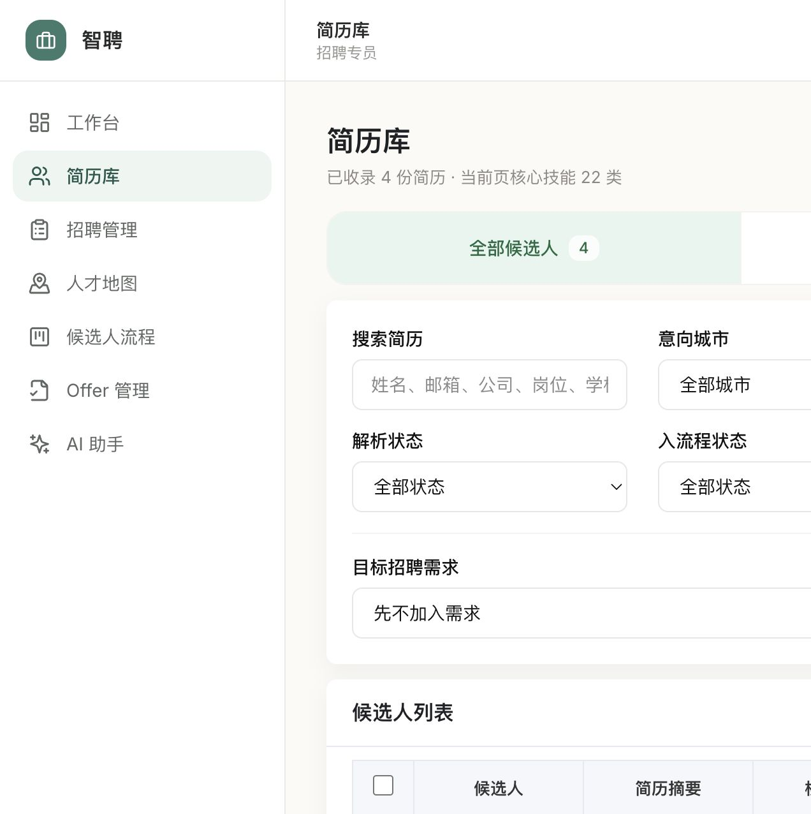

# 2026-07-22 本地四角色验收证据

> 结论：当前分支已形成可推送 CFPD `test` 的本地候选；这份记录只证明本机代码与浏览器验收，不代表公司 SIT 已构建、已部署或已上线。

## 验收环境

- 日期与时区：2026-07-22，Asia/Shanghai
- 分支：`codex/readdy-test-product`，基于 `origin/test@5e251a2`
- 后端：Python 3.12.12，`http://127.0.0.1:5001`
- 本地 OAuth 验收桥：`http://127.0.0.1:5100`
- 前端：`http://localhost:5174`
- 数据：本地可丢弃 SQLite 演示库
- 账号：`admin01`、`manager01`、`hr01`、`interviewer01`，统一使用文档中的本地演示密码

本地 OAuth 验收桥只用于让四类演示账号复用正式前端的网关登录调用形状。它绑定本机地址、不打印密码或 Token，也不修改公司登录、权限入口、Apollo 默认环境和 Token 链路；正式构建与公司 SIT 不使用该桥。

## 四角色结果

| 角色 | 已验证入口 | 越权结果 |
|---|---|---|
| 管理员 | 工作台、需求、简历库、看板、面试、Offer、已入职、分析、总监审批、系统设置 | 正常进入授权页面 |
| 招聘经理 | 总监驾驶舱、分析、看板、面试、Offer、KPI 标准 | 管理员设置、面试官专属页回到工作台 |
| 招聘专员 | 简历库、看板、面试、Offer、已入职、人才地图、AI 助手 | 分析、总监、KPI、管理员和面试官专属页回到工作台 |
| 面试官 | 面试官工作台、我的面试、已分配候选人、参与岗位 | 全量简历、全量面试、Offer、分析、管理员页面回到面试官工作台 |

面试官登录后只请求身份、分配任务、面试和通知数据，不再预加载无权限的 AI 会话接口。

## 反向操作结果

1. 新建同一 Job 下两条 Demand，候选人以明确 `demand_id` 加入其中一条；两条 Demand 的看板互相隔离。
2. Demand 从 `active` 暂停为 `paused`，填写原因后再恢复为 `active`。
3. 候选人从 `pending` 推进到 `ai_screen`，再通过“修正阶段”填写原因回到 `pending`。
4. 历史弹窗保留上述追加式流水，没有覆盖或删除旧记录。
5. Offer 在 Demand 或候选人数据加载失败时不给空表单提交，并提供重试或下一步提示。

本地旧演示库仍包含 `demand_id IS NULL` 的兼容数据。在同一 Job 只有一条 Demand 时，服务端会按既有兼容规则纳入旧行；创建第二条 Demand 后兼容回退自动关闭，明确 `demand_id` 的详情与看板口径一致。本轮没有删除这条历史兼容逻辑，也不把本地演示库称为已完成生产 Strict 回填。

## 自动化门禁

| 门禁 | 结果 |
|---|---|
| 前端测试 `npm test` | 通过 |
| 前端代码检查 `npm run lint` | 通过 |
| 前端类型检查 `npm run typecheck` | 通过 |
| 前端生产构建 `npm run build` | 通过 |
| 后端全量 `ALLOW_PUBLIC_REGISTRATION=false ../.venv/bin/python -m pytest tests/` | 446 passed |
| Base Agent `../.venv/bin/python -m pytest base_agent/tests` | 6 passed |
| Alembic heads | `20260721_06 (head)` |

后端全量测试显式覆盖 `ALLOW_PUBLIC_REGISTRATION=false`，避免本机 `.env` 的宽松 SIT 开关影响生产安全断言。本地 SQLite 是否完成正式 Demand Strict 回填不由单元测试替代，仍需按迁移手册在公司测试库执行 audit、审批、backfill 和 verify。

## 关键截图

### 管理员：看板修正与完整历史

### 招聘经理：总监驾驶舱

### 招聘专员：真实简历库

### 面试官：我的面试

## 尚需公司环境完成

1. 将候选分支按公司流程推送并合入 CFPD `test`。
2. 触发 Libra 构建并确认部署的 Git SHA 与目标提交一致。
3. 在公司 SIT 复核真实网关登录、菜单/按钮权限、`X-Emp-Code`、Apollo `appId=zhipin`、MCP SSO Token 与三类第三方 Token 交换。
4. 使用公司测试库执行 Demand Strict audit/backfill/verify，并留存报告。
5. 在 SIT 再走一遍四角色主流程与越权 URL，保存部署地址、时间、SHA、截图和关键接口状态。
