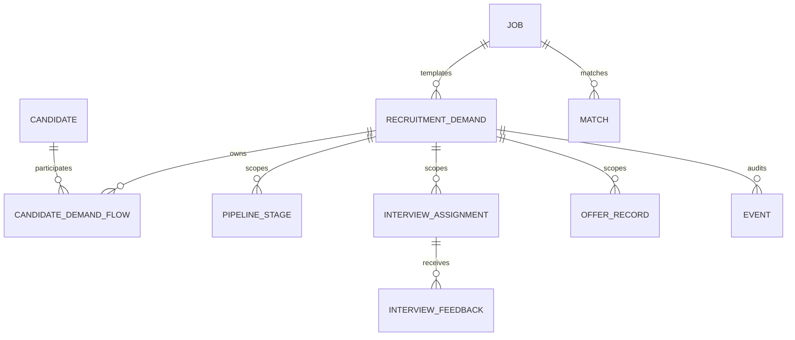

# Demand-scoped Recruitment P0 Design

> 状态：依据 2026-07-10 真实用户会议与产品负责人确认的 16 条规则形成，替代旧方案中“同一岗位画像只能有一个未结束需求”的业务假设。
> 范围：一期试点 P0；不扩展人才地图、招聘渠道集成、OA 自动流转或复杂 ATS 配置中心。

## 1. 产品判断：先把“招聘责任单”做对

如果用一种克制、重视真实用户动作的产品方法看这次会议，问题不在于页面不够丰富，而在于系统没有围绕用户真正要完成的对象组织信息：

- HR 想找的是“这一次招聘需求”，不是抽象岗位模板。
- 用人负责人想知道“现在卡在哪里、轮到谁”，不是看一组不能点击的数字。
- 面试官只需要看完整简历、完成本轮反馈，不应该被迫理解整个 ATS。
- AI 应减少阅读和整理成本，但不能替人做淘汰、Offer、转派或流程推进决定。

因此 P0 的唯一主线是：`Job` 作为可复用职位/JD 模板；`RecruitmentDemand` 作为一次真实招聘责任单；候选人流程、面试、Offer、HC、审计与 BI 全部归 `demand_id`。页面围绕“找到需求 → 看清进度 → 下钻候选人 → 完成当前责任动作”设计。

## 2. 市面产品可借鉴的机制

借鉴机制，不复制品牌视觉、源码或专有文案：

| 成熟机制 | 参考 | 本项目一期取舍 |
|---|---|---|
| 职位/岗位与招聘名额（opening/requisition）分层 | Workable 支持一个 job 下多个 requisition；Greenhouse 区分 job、opening/requisition | 采用 `Job → RecruitmentDemand` 一对多；城市、部门、月份、HC、负责人属于 Demand |
| 招聘列表直接展示阶段数量，数字可进入该阶段候选人 | Workable Jobs 页按 job 展示 pipeline，并允许点击阶段数进入候选人 | 需求表格中阶段数字均为链接，携带 `demand_id + stage` |
| 详细面试动作映射到稳定的报告阶段 | Greenhouse/Workable 均区分详细 interview 与用于跨岗位统计的标准 milestone/reporting stage | 主流程保留“面试中”，一面/二面/终面/加面是内部轮次任务 |
| 候选人档案既是事实阅读页，也是有限动作入口 | Workable candidate profile 集中简历与协作动作 | 原始简历置顶为事实真源；结构化画像和匹配分析为辅助页签；高风险动作保持人工确认 |
| AI 先读后写、权限沿用原系统 | Greenhouse 官方 AI/MCP 指南建议先从只读报告和总结开始 | 一期 AI 仅解析、匹配、总结和建议，写流程工具从工具目录移除 |
| 数据看板用于发现停滞与责任人 | Greenhouse current pipeline、Lever recruiter operations 聚焦 stage age、outstanding feedback、open requisitions | 一期只做进度、卡点、责任协同，不做个人绩效排名 |

## 3. 会议问题分型

### 3.1 明确的代码缺失

- 需求页仍是卡片流，没有表格、状态分类、筛选、分页、创建时间排序。
- 需求创建缺少完整必填校验与统一红星；创建成功不进详情。
- 需求阶段数字不可下钻。
- `demand_id` 未进入 pipeline、面试、Offer、处置、审计和 BI。
- 转需求当前把来源写成淘汰；没有“一名候选人仅一条进行中流程”的原子约束。
- AI 初筛会直接推进或淘汰候选人。
- 面试轮次没有主面试官完成规则；HR 确认边界不完整。
- 简历页没有“原始简历 / 结构化画像 / 匹配分析”三页签，AI 判断固定占宽。
- BOSS、人才地图和无有效数据的 BI 仍有正式入口。

### 3.2 更可能是 SIT 版本或运行时问题

- “候选人搜索框不能输入”：当前源码已有受控输入、防抖、服务端检索与分页；需核对 SIT 静态资产、浏览器遮挡层和控制台错误。
- “本地正常、测试环境异常”：当前 CFPD `test` 远端 SHA 为 `690e00a892a7`，本地已提交基线为 `f2c3ace03a1c`，测试站 HTML `Last-Modified` 为 2026-07-08；不能把本地能力当作已发布。
- “BOSS 导入本地可用、测试环境不可用”：属于未完成的外部依赖/凭据/运行环境能力，一期应隐藏入口而非承诺可用。

### 3.3 底层已有但入口不可发现

- 后端已有需求详情读取接口，但前端没有 `/demands/:id` 页面，创建返回值被丢弃。
- 流程页已有 stage 查询参数能力，但需求阶段数字不是链接。
- 站内面试任务和通知已有基础能力，但未围绕需求、轮次与主面试官组织。
- 结构化简历渲染器能展示数组与换行，但没有原始文件事实页，也无法补救上游解析已丢失的版式。

### 3.4 已实现或不阻塞试点

- 内部账号登录可运行；企业登录不阻塞一期。
- 角色导航已有基础过滤；本轮继续精简，不新建第二套权限。
- OA 前端入口当前未暴露；保持隐藏，站内待办 + 人工提醒承接一期协作。

## 4. 领域模型



### 4.1 Job：可复用职位/JD 模板

- 保留 `title`、`jd_text`、结构化 JD、画像维护人。
- `Match` 继续按 `job_id`，因为匹配比较的是候选人与职位标准。
- 关闭/恢复单个 Demand 不改变 Job 状态；Demand 转派不改变 Job 维护人。

### 4.2 RecruitmentDemand：一次招聘责任单

新增或收紧：

- `city`、`department`、`job_title_snapshot`、`jd_text_snapshot`
- `owner_hr_id`、`created_by`
- `request_no`（组织内唯一，服务端可生成）
- `requested_at`、`target_date`、`headcount`、`hiring_manager_name`
- `closed_at`、`closed_by`、`close_reason`

状态：`pending / active / paused / filled / cancelled / closed`。暂停、取消、提前关闭必须给原因。`onboarded_count >= headcount` 只返回 `completion_suggested=true`，不自动把 Demand 改为完成。

### 4.3 CandidateDemandFlow：候选人与需求的应聘关系

字段：`org_id, candidate_id, demand_id, owner_hr_id, status, started_at, ended_at, transfer_from_demand_id, transfer_reason`；`(org_id, candidate_id, demand_id)` 唯一。

Candidate 增加 nullable `current_demand_id` 作为一期跨数据库的当前流程指针。加入/转需求时锁 Candidate 行：

- 没有当前流程：创建 Flow、写 `pending`、设置当前 Demand 与当前负责人。
- 已有其他当前流程：普通加入返回 409。
- 转需求：来源追加 `transferred`，来源 Flow 终止；目标创建/恢复 Flow 并从 `pending` 开始；更新当前 Demand 和当前负责人；不计入淘汰。
- `rejected / onboarded / transferred` 后清空或切换当前指针。

负责人历史操作者不重写。需求转派更新 Demand、活动 Flow 和该 Demand 中当前活动候选人的当前 owner，历史 `updated_by / interviewer_id / actor_id` 保持不变。

### 4.4 流程事实

以下表在兼容期新增 nullable `demand_id`，并保留 `job_id` 双写：

- `pipeline_stages`
- `interviews`
- `interview_assignments`
- `interview_feedback`
- `offer_records`
- `candidate_dispositions`
- `events`

`notifications` 与 `upload_batches` 可增加 nullable `demand_id` 以支持深链和导入目标。所有新写入先解析 Demand，再由服务端派生 `job_id`；请求同时携带两者且不一致时拒绝。

### 4.5 面试轮次

主流程只存 `interview`。`InterviewAssignment` 增加：

- `demand_id`
- `round_sequence`
- `is_primary`

`InterviewFeedback` 增加 `assignment_id` 与 `demand_id`。同一需求、候选人、轮次只能有一个有效主面试官；主面试官反馈后返回 `round_completed=true`，辅助面试官反馈不结束本轮。任何反馈都不会自动推进或淘汰，后续动作由 HR/经理/管理员确认。

## 5. API 与兼容契约

### 5.1 新契约

- `/api/demands`：分页对象 `{items,total,page,page_size,pages}`，支持 `status,q,department,city,owner_hr_id,page,page_size,sort`；默认 `created_at desc`。
- `/api/demands/:id`：需求详情与 demand-scoped metrics。
- `/api/pipeline/demands/:demand_id`：看板、阶段历史、Offer。
- `/api/pipeline/move`：要求 `candidate_id + demand_id + stage`。
- `/api/pipeline/transfer`：要求 `candidate_id + from_demand_id + to_demand_id + reason`。
- `/api/interviews/*`：业务动作要求 `demand_id`；匹配类接口仍要求 `job_id`。
- `/api/bi/demand/:demand_id`：单需求下钻。

### 5.2 旧客户端兼容

- P0 保留旧 `job_id` 字段和 job-only 路由。
- 当一个 Job 只能解析到唯一可用 Demand 时，旧请求可兼容并记录 fallback 事件。
- 当存在多个候选 Demand 时返回 409：`code=demand_id_required`，绝不默认选择“最新需求”。
- P0 不删除旧列；严格切换稳定一个发布周期后再讨论 Contract。

### 5.3 创建防重复

- 前端事件开始即锁定提交，成功/失败前不可再次提交。
- 客户端为每次创建生成 `Idempotency-Key`；同 key + 同请求体返回首个结果，同 key + 不同请求体返回 409。
- 后端保留数据库唯一 request_no 和幂等记录；允许同一 Job 创建多个不同 Demand，不把“同岗位”误判为重复。
- 成功返回 201 后前端直接进入 `/demands/:id`。

## 6. demand_id 迁移

采用 Expand → Backfill → Dual-write/Shadow-read → Strict cutover → Contract，不继续依赖应用启动时的多 worker `ALTER TABLE`。

### 6.1 Expand

- 引入 Alembic（或等价 revision ledger）。应用启动只校验 revision，不执行 demand 多表 DDL。
- 新表、nullable `demand_id`、索引和 FK 均为 additive。
- 索引以 `(org_id,demand_id,candidate_id,...)` 为主；FK `ON DELETE RESTRICT`。

### 6.2 Backfill 分类

按 `(org_id,candidate_id,job_id)` 形成事实 bundle：

- A：Job 只有一个 Demand，可自动映射。
- B：有流程事实但没有 Demand，输出“历史迁移需求”候选，需批准后创建。
- C：多个 Demand，但有唯一且不重叠的时间证据，可按批准规则映射。
- D：多个 Demand 且重叠/无可靠边界，导出人工映射，禁止猜测。
- E：跨组织、孤儿外键、时间线异常，直接阻断。

回填脚本必须支持 `--dry-run`、幂等重跑、批次清单和 `旧记录 ID → demand_id → 依据` 报告。顺序：需求主数据 → Flow → Pipeline → Interview/Assignment/Feedback → Offer/Disposition → Event。

### 6.3 Cutover 门禁

- 核心事实 `demand_id` 无空值。
- 每行 `job_id == demand.job_id`。
- 歧义与跨组织错误为 0。
- 新前端、API、AI、BI、通知与审计均已 demand-scoped。
- 老 worker 与旧静态资产退出。
- 备份与恢复已在同引擎临时库演练。

## 7. 回滚与数据库风险

- Expand、Backfill、Dual-write 阶段可回滚应用；新增表/列保留。
- 一旦允许同一 Job 并行多个 Demand，旧代码无法表达新事实，不能只回退旧镜像。
- Strict cutover 后只允许向前修复，或停写后整体恢复“切换前数据库 + uploads”；这会丢失切换后业务数据。
- PostgreSQL 大表索引需并发创建、FK 可延迟验证；MySQL DDL 隐式提交，必须逐 revision 执行；SQLite 仅用于开发并使用 batch migration。
- 当前恢复脚本未覆盖 MySQL 的可演练恢复。若试点数据库为 MySQL，补齐临时库恢复或取得 DBA 恢复证据，是迁移发布硬门槛。
- 迁移不能由 4 个 Gunicorn worker 启动时并发执行；Libra 必须明确一次性 migration job/运维步骤。

## 8. 一期信息架构

- 招聘专员：工作台、招聘需求、候选人、候选人流程、AI 助手（只读建议）、通知。
- 招聘经理：工作台、招聘需求、候选人流程、协同看板、通知。
- 面试官：工作台、我的面试、通知。
- 管理员：在经理能力外增加账号、审计、系统设置。

职位/JD 模板作为创建需求和匹配时的二级入口，不单独占主导航。BOSS、人才地图、无真实数据的 BI、OA 占位入口均不在试点主导航；代码可以保留，但写入路径必须 fail closed。

## 9. 给 AI 的产品提示词

```text
你是智聘一期的产品与实现助手。你的目标不是让功能显得多，而是让招聘专员、用人负责人和面试官在最短路径内完成真实任务。

先判断用户当前要处理的是职位模板 Job，还是一次招聘需求 Demand。Job 只保存可复用职位/JD与匹配标准；Demand 才是部门、城市、月份、HC、负责人、流程、面试、Offer、审计和 BI 的业务归属。任何业务事实都必须先解析 demand_id，再由 Demand 派生 job_id；不能把多个 Demand 按 job_id 混算。

候选人一期只允许一条进行中流程。换需求必须在同一事务中把原流程记为 transferred，把目标流程从 pending 开始，并跟随目标 Demand 负责人；transferred 不是 rejected。历史操作者、面试官和审计记录永远不重写。

主流程只有“面试中”；一面、二面、终面、加面是轮次任务。主面试官反馈只完成本轮，推进或淘汰仍由 HR 明确确认。

AI 只能解析、匹配、总结和给建议。不得自动淘汰、推进、发 Offer、转派负责人或关闭需求；不得通过 prompt、前端按钮隐藏或临时开关绕过 RBAC、确认、审计和服务端校验。

设计页面时先回答：用户第一眼要做什么？没有数据怎么办？选不到对象为什么？误操作如何补救？数字能否下钻到事实？原始简历永远是事实真源，AI 结果必须标明是辅助判断且可收起。

一期坚持 YAGNI：不扩人才地图、渠道集成、OA 自动化、复杂 ATS 配置和正式绩效。借鉴成熟产品的对象模型和交互机制，但不复制品牌视觉、源码或专有文案。

每次改动必须同步 PRD、SDD、BI 与试点验收文档；先写失败测试，再做最小实现，并报告兼容、迁移、回滚与未验证风险。
```

## 10. 非目标

- P1：招聘档案打印与归档。
- 不实现人才地图、BOSS/58/猎聘渠道对接。
- 不实现企业登录、OA 日历、自动短信/邮件。
- 不实现可视化流程编排、复杂审批、正式绩效与招聘成本核算。
- 不在 P0 删除 legacy `job_id` 列。
